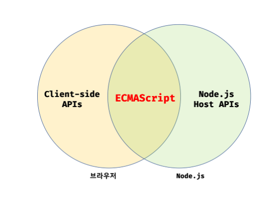

# 자바스크립트 개발 환경과 실행 방법

## 3.1 자바스크립트 실행 환경

모든 브라우저는 자바스크립트를 해석하고 실행할 수 있는 자바스크립트 엔진을 내장하고 있다.
브라우저 뿐만 아니라 Node.js 도 자바스크립트 엔진을 내장하고 있다. 따라서 자바스크립트는 브라우저 환경 또는
Node.js 환경에서 실행할 수 있다. 기본적으로 브라우저에서 동작하는 코드는 Node.js 환경에서도 동일하게 동작한다.

그런데 한 가지 주의해야할 점은 브라우저와 Node.js는 용도가 다르다는 것이다. 브라우저는 HTML, CSS , 자바스크립트를 실행해
웹페이지를 브라우저 화면에 렌더링하는 것이 주된 목적이지만 Node.js 는 브라우저 외부에서 자바스크립트 실행 환경을 제공하는 것이
주된 목적이다.

따라서 브라우저와 Node.js 모두 자바스크립트의 코어인 ECMAScript 를 실핼 할 수 있지만 브라우저와 Node.js ECMAScript 이외에
추가로 제공하는 기능은 호환되지 않는다.

예를 들어, 브라우저는 파싱된 HTML 요소를 선택하거나 조작하는 기능의 집합인 DOM API를 기본적으로 제공한다.
하지만 브라우저 외부에서 자바스크립트 개발 환경을 제공하는 것이 주 목적인 Node.js 는 DOM API를 제공하지 않는다.
브라우저 외부 환경에서는 HTML 요소를 파싱해서 객체화한 DOM 을 직접 다룰 필요가 없기 때문이다.

반대로 Node.js 에서는 파일을 생성하고 수정할 수 있는 파일 시스템을 기본 제공하지만 브라우저는 이를 지원하지 않는다.

## 3.2 웹 브라우저

크롬 브라우저의 V8 자바스크립트 엔진은 Node.js 에서도 사용하고 있다.

### 3.2.1 개발자 도구

### 3.2.2 콘솔

### 3.2.3 브라우저에서 자바스크립트 실행

### 3.2.4 디버깅

## 3.3 Node.js

### 3.3.1 Node.js 와 npm 소개

### 3.3.2 Node.js 설치

### 3.3.3 Node.js REPL

## 3.4 비주얼  스튜디오 코드