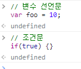
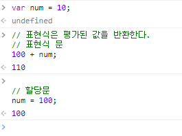

# 표현식 과 문


## 5.1 값

값은 식(표현식)이 평가 되어 생성된 결과를 말한다. 
평가란 식을 해석해서 값을 생성하거나 참조하는 것을 의미한다. 
다음 예제의 식은 평가되어 숫자 값 30을 생성한다.

```javascript
// 10과 20은 평가되어 숫자 값 30을 생성한다.
10 + 20; // 30
```

## 5.2 리터럴

리터럴은 사람이 이해할 수 있는 문자 또는 약속된 기호를 사용해 값을 생성하는 표기법을 말한다. 

리터럴은 사람이 이해할 수 있는 문자 또는 미리 약속된 기호로 표기한 코드다.
자바스크립트 엔진은 코드가 실행되는 시점인 런타임에 리터럴을 평가해 값을 생성한다.

즉, 리터럴은 값을 생성하기 위해 미리 약속한 표기법이라고 할 수 있다. 

## 5.3 표현식

표현식은 값으로 평가될 수 있는 문이다. 즉, 표현식이 평가되면  새로운 값을 생성하거나 기존 값을 참조한다.

앞서 살펴본 리터럴은 값으로 평가된다. 따라서 리터럴도 표현식이다. 


표현식은 리터럴,식별자(변수 , 함수 등의 이름) , 연산자, 함수 호출 등의 조합으로 이뤄질 수 있다. 
다음과 같이 다양한 표현식이 있지만 값으로 평가된다는 점에서 모두 동일하다. 즉 ,값으로 평가될 수 있는 문은 모두 표현식이다.

```javascript
// 리터럴 표현식
10
'Hello'

// 식별자 표현식 (선언이 미리 존재한다고 가정)
sum
person.name
arr[1]

// 연산자 표현식
10 + 20
sum = 10
sum !== 10


// 함수 / 메서드 호출 표현식 (선언이 이미 존재한다고 가정)
square()
person.getName()
```


## 5.4 문

문 <sup>statement</sup> 은 프로그램을 구성하는 기본 단위이자 최소 실행 단위다. 문의 집합으로 이뤄진 것이
바로 프로그램이며, 문을 작성하고 순서에 맞게 나열하는 것이 프로그래밍이다. 

문은 여러 토큰으로 구성된다. 토큰이란 문법적인 의미를 가지며, 문법적으로 더 이상 나눌수 없는 코드의 기본 요소를 의미한다.
예를 들어, 키워드, 식별자, 연산자, 리터럴 , 세미콜론(;)이나 마침표(.) 등의 특수 기호는 문법적인 의미를 가지며 , 문법적으로 더 이상 나눌 
수 없는 코드의 기본 요소이므로 모두 토큰이다.

문은 명령문이라고도 부른다. 즉, 문은 컴퓨터에 내리는 명령이다. 문이 실행되면 명령이 실행되고 무슨 일인가가 일어나게 된다.

문은 선언문, 할당문, 조건문 , 반복문 등으로 구분할 수 있다. 변수 선언문을 실행하면 변수가 선언되고, 할당문을 실행하면 값이 할당된다.

## 5.5 세미콜론과 세미콜론 자동 삽입 기능

세미콜론은 문의 종료를 나타낸다. 즉, 자바스크립트 엔진은 세미콜론으로 문이 종료한 위치를 파악하고
순차적으로 하나씩 문을 실행한다. 따라서 문을 끝낼 때는 세미콜론을 붙여야 한다. 
단, 0개 이상의 문을 중괄호로 묶은 코드 블록({...}) 뒤에는 세미콜론을 붙이지 않는다.
예를 들어, if 문 , for 문 , 함수 등의 코드 블록 뒤에는 세미콜론을 붙이지 않는다. 
이러한 코드 블록은 언제나 문의 종료를 의미하는 자체 종결성을 갖기 때문이다. 

문의 끝에 붙이는 세미콜론은 옵션이다. 즉 , 세미콜론은 생략 가능하다. 
이는 자바스크립트 엔진이 소스코드를 해석할 때 문의 끝이라고 예측되는 지점에 세미콜론을 자동으로 붙여주는 세미콜론 자동 삽입 기능이 
암묵적으로 수행되기 때문이다. 

## 5.6 표현식인 문과 표현식이 아닌 문

표현식은 문의 일부 일수도 있고 그 자체로 문이 될 수도 있다.

```javascript
// 변수 선언문은 값으로 평가될 수 없으므로 표현식이 아니다.
var x;

// 1,2 , 1+2, x = 1 +2 는 모두 표현식이다.
// x = 1+2 는 표현식이면서 완전한 문이기도 하다.
x = 1+2;
```

문에는 표현식인 문과 표현식이 아닌 문이 있다.

표현식인 문과 표현식이 아닌 문을 구별하는 가장 간단하고 명료한 방법은 변수에 할당해 보는 것이다.
표현식인 문은 값으로 평가되므로 변수에 할당할 수 있다. 하지만 표현식이 아닌 문은 값으로 평가할 수 없으므로 
변수에 할당하면 에러가 발생한다.

```javascript
// 표현식이 아닌 문은 값처럼 사용할 수 없다.
var foo = var x; // SyntaxError: Unexpected token 'var'
```

변수 선언문은 표현식이 아닌 문이다. 다시 말해 값으로 평가될 수 없다. 따라서 변수 선언문은 값처럼 사용할 수 없다. 

```javascript
// 변수 선언문은 표현식이 아닌 문이다.
var x;

// 할당문은 그 자체가 표현식이지만 완전한 문이기도 하다. 즉 , 할당문은 표현식인 문이다.
x = 100;
```

**완료 값**

크롬 개발자 도구에서 표현식이 아닌 문을 실행하면 언제나 undefined를 출력한다. 이를 완료 값이라 한다.
완료 값은 표현식의 평가 결과가 아니다. 따라서 다른 값과 같이 변수에 할당할 수 없고
참조할 수도 없다.



크롬 개발자 도구에서 표현식인 문을 실행하면 언제나 평가된 값을 반환한다.



