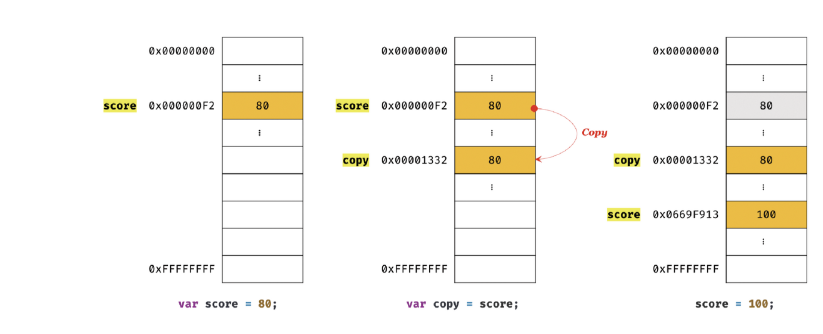

# 원시 값과 객체의 비교

원시타입과 객체 타입은 근본적으로 다르다.

- 원시 타입의 값, 즉 원시 값은 변경 불가능한 값이다. 이에 비해 객체(참조) 타입의 값, 즉 객체는 변경 가능한 값이다.
- 원시 값을 변수에 할당하면 변수(확보된 메모리 공간)에는 실제 값이 저장된다. 이에 비해 객체를 변수에 할당하면 변수(확보된 메모리 공간)에는 참조 값이 저장된다.
- 원시 값을 갖는 변수를 다른 변수에 할당하면 원본의 원시 값이 복사되어 전달된다. 이를 값에 의한 전달이라 한다. 이에 비해 객체를 가리키는 변수를 다른 변수에 할당하면
원본의 참조 값이 복사되어 전달된다. 이를 참조에 의한 전달이라 한다. 


## 11.1 원시 값

### 11.1.1 변경 불가능한 값

원시 타입의 값 즉, 원시 값은 변경 불가능한 값이다. 다시 말해, 한번 생성된 원시 값은 읽기 전용 값으로서 변경할 수 없다. 

값을 변경할 수 없다는 것이 구체적으로 무엇을 말하는지 생각해보자. 
먼저 변수와 값은 구분해서 생각해야 한다.  

변수는 하나의 값을 저장하기 위해 확보한 메모리 공간 자체 또는 그 메모리 공간을 식별하기 윟 ㅐ
붙인 이름이고, 값은 변수에 저장된 데이터로서 표현식이 평가되어 생성된 결과를 말한다. 
변경 불가능하다는 것은 변수가 아니라 값에 대한 진술이다.

즉 "원시 값은 변겅 불가능하다"는 말은 원시 값 자체를 변경할 수 없다는 겂이지 변수 값을 변경할 수 없다는
것이 아니다. 변수는 언제든지 재할당을 통해 변수 값을 변경 할 수 있다. 

원시 값을 할당한 변수에 새로운 원시 값을 재할당하면 메모리 공간에 저장되어 있는 재할당 이전의
원시 값을 변경하는 것이 아니라 새로운 메모리 공간을 확보하고 재할당한 원시 값을 저장한 후,
변수는 새롭게 재할당한 원시 값을 가리킨다. 이때 변수가 참조하던 메모리 공간의 주소가 바뀐다.


변수가 참조하던 메모리 공간의 주소가 변경된 이유는 변수에 할당된 원시 값이 변경 불가능한 값이기 때문이다.
만약 원시 값이 변경 가능한 값이라면 변수에 새로운 원시 값을 재할당했을 때 변수가 가리키던 메모리 공간의 주소를 바꿀 필요없이
원시 값 자체를 변경하면 그만이다. 만약 그렇다면 변수가 참조하던 메모리 공간의 주소는 바뀌지 않는다. 


하지만 원시 값은 변경 불가능한 값이기 때문에 값을 직접 변경할 수 없다.
따라서 변수 값을 변경하기 위해 원시 값을 재할당하면 새로운 메모리 공간을 확보하고 재할당한 값을 저장한 후, 변수가 참조하던 메모리 공간의
주소를 변경한다. 
값의 이러한 특성을 불변성이라 한다.

불변성을 갖는 원시 값을 할당한 변수는 재할당 이외에 변수 값을 변경할 수 있는 방법이 없다. 만약 
재할당 이외에 원시 값인 변수 값을 변경할 수 있다면 예기치 않게 변수 값이 변경될 수 있다는 것을 의미한다.
이는 값의 변경 , 즉 상태 변경을 추적하기 어렵게 만든다.


### 11.1.2 문자열과 불변성

원시 값을 저장하려면 먼저 확보해야 하는 메모리 공간의 크기를 결정해야 한다.
이를 위해 원시 타입별로 메모리 공간의 크기가 미리 정해져 있다고 했다.

원시 값인 문자열은 다른 원시 값과 비교할 때 독특한 특징이 있다. 
문자열은 0개 이상의 문자로 이뤄진 집합을 말하며, 1개의 문자는 2바이트의 메모리 공간에 저장된다.
따라서 문자열은 몇 개의 문자로 이뤄졌느냐에 따라 필요한 메모리 공간의 크기가 결정된다.

C에는 하나의 문자를 위한 데이터 타입만 있을 뿐 문자열 타입은 존재하지 않는다.
C에서는 문자열을 문자의 배열로 처리하고 자바에서는 문자열을 String 객체로 처리한다. 

자바스크립트의 문자열은 원시 타입이며, 변경 불가능하다. 이것은 문자열이 생성된 이후에는
변경할 수 없음을 의미한다.

```javascript
var str = "Hello";
str = "world";
```

첫 번째 문이 실행되면 문자열 'Hello' 가 생성되고 식별자 str 은 문자열 'Hello'가 저장된 메모리 공간의
첫 번째 메모리 셀 주소를 가리킨다. 그리고 두 번째 문이 실행되면 이전에 생성된 문자열 "Hello"를 수정하는 것이 아니라
새로운 문자열 "world"를 메모리에 생성하고 식별자 str 은 이것을 가리킨다.

문자열의 한 문자를 변경해보자. 문자열은 유사 배열 객체이면서 이터러블이므로 배열과 유사하게 각 문자에 접근할 수 있다.


**유사 배열 객체**

`유사 배열 객체란 마치 배열처럼 인덱스로 프로퍼티 값에 접근할 수 있고 length 프로퍼티를 갖는 객체를 말한다. 
문자열은 마치 배열처럼 인덱스를 통해 각 문자에 접근할 수 있으며, length 프로퍼티를 갖기 때문에
유사 배열 객체이고 for 문으로 순회할 수도 있다.`

```javascript
var str = "string";

// 문자열은 유사 배열이므로 배열과 유사하게 인덱스를 사용해 각 문자에 접근할 수 있다.
console.log(str[0]); // s


// 원시 값인 문자열이 객체처럼 동작한다.
console.log(str.length); // 6
console.log(str.toUpperCase()); // STRING
```

갑자기 원시 값인 문자열이 객체일 수도 있다니 혼란스러울 수 있겠다.
아직 살펴보지 않았지만 원시 값을 객체처럼 사용하면 원시 값을 감싸는 래퍼 객체로 자동 변환된다.

```javascript
var str = "string";


// 문자열은 유사 배열이므로 배열과 유사하게 인덱스를 사용해 각 문자에 접근할 수 있다.
// 하지만 문자열은 원시 값이므로 변경할 수 없다. 이때 에러가 발생하지 않는다.
str[0] = 'S';

console.log(str); // string
```


str[0] = 'S' 처럼 이미 생성된 문자열의 일부 문자를 변경해도 반영되지 않는다.
문자열은 변경 불가능한 값이기 때문이다. 이처럼 한번 생성된 문자열은 읽기 전용 값으로서 변경할 수 없다.
원시 값은 어떤 일이 있어도 불변한다. 따라서 예기치 못한 변경으로부터 자유롭다.
이는 데이터의 신뢰성을 보장한다.

그러나 변수에 새로운 문자열을 재할당하는 것은 물론 가능하다. 
이는 기존 문자열을 변경하는 것이 아니라 새로운 문자열을 새롭게 할당하는 것이기 때문이다. 

### 11.1.3 값에 의한 전달

```javascript
var score = 80;
var copy = score;

console.log(score); // 80
console.log(copy); // 80

score = 100;

console.log(score); // 100
console.log(copy); // 80
```

"변수에 변수를 할당했을 때 무엇이 어떻게 전달되는가?" copy = score 에서  
score 는 변수 값 80으로 평가되므로 copy 변수에도 80이 할당될 것이다. 
이때 새로운 숫자 값 80이 생성되어 copy 변수에 할당된다.

이처럼 변수에 원시 값을 갖는 변수를 할당하면 할당받는 변수에는 할당되는 변수의 원시 값이 복사되어 전달된다.
이를 값에 의한 전달이라 한다. 위 예제의 경우 copy 변수에 원시 값을 갖는 score 변수를 할당하면
할당받는 변수에는 할당되는 변수의 원시 값 80이 복사되어 전달된다.


```javascript
var score = 80;


// copy 변수에는 score 변수의 값 80이 복사되어 할당된다.
var copy = score;

console.log(score,copy); // 80 80
console.log(score === copy); // true
```

이때 score 변수와 copy 변수는 숫자 값 80을 갖는다는 점에서 동일하다. 하지만 score 변수와
copy 변수의 값은 80은 다른 메모리 공간에 저장된 별개의 값이다.


```javascript
var score = 80;

// copy 변수에는 score 변수의 값 80이 복사되어 할당된다.
var copy = score;

console.log(score,copy); // 80 80
console.log(score === copy); // true

// score 변수와 copy 변수의 값은 다른 메모리 공간에 저장된 별개의 값이다.
score = 100;

console.log(score,copy); // 100 80
console.log(score === copy); // false
```



위 그림에서는 변수에 원시 값을 갖는 변수를 할당하면 원시 값이 복사되는 것 처럼 표현했다. 하지만 변수에
원시 값을 갖는 변수를 할당하는 시점에는 두 변수가 같은 원시 값을 참조하다가 어느 한쪽의 변수에
재할당이 이뤄졌을 때 비로소 새로운 메모리 공간에 재할당된 값을 저장하도록 동작 할 수 도있다.

참고로 파이썬은 이처럼 동작한다.


두 변수의 원시 값은 서로 다른 메모리 공간에 저장된 별개의 값이 되어 어느 한쪽에서 재할당을 통해 값을 변경하더라도 서로 간섭할 수 없다는 것이다.

## 11.2 객체

객체는 프로퍼티의 개수가 정해져 있지 않으며, 동적으로 추가되고 삭제할 수 있다.
또한 프로퍼티의 값에도 제약이 있다. 따라서 객체는 원시 값과 같이 확보해야 할 메모리 공간의 크기를 사전에 정해둘 수 없다.

객체는 복합적인 자료구조이므로 객체를 관리하는 방식이 원시 값과 비교해서 복잡하고 구현 방식도 브라우저 제조사마다 다를 수 있다. 
원시 값은 상대적으로 적은 메모리를 소비하지만 객체는 경우에 따라 크기가 매우 클 수도 있다.


**자바스크립트 객체의 관리 방식**

자바스크립트 객체는 프로퍼티 키를 인덱스로 사용하는 해시 테이블이라고 생각할 수 있다.
대부분의 자바스크립트 엔진은 해시 테이블과 유사하지만 높은 성능을 위해 일반적인 해시 테이블보다 나은 방법으로 객체를 구현한다.

자바,C++ 같은 클래스 기반 객체지향 프로그래밍 언어는 사전에 정의된 클래스를 기반으로 객체를 생성한다. 
다시 말해, 객체를 생성하기 이전에 이미 프로퍼티와 메서드가 정해져 있으며 그대로 객체를 생성한다. 
객체가 생성된 이후에는 프로퍼티를 삭제하거나 추가할 수 없다. 하지만 자바스크립트는 클래스 없이 객체를 생성할 수 있으며 객체가  생성된 이후라도
동적으로 프로퍼티와 메서드를 추가할 수 있다. 이는 사용하기 매우 편리하지만 성능 면에서는 이론적으로 클래스 기반 객체지향 프로그래밍 언어의 객체보다
생성과 프로퍼티 접근에 비용이 더 많이 드는 비효율적인 방식이다.


### 11.2.1 변경 가능한 값

객체 타입의 값, 즉 객체는 변경 가능한 값이다. 

```javascript
var person = {
    name : "Park"
};
```

원시 값은 변경 불가능한 값이므로 원시 값을 갖는 변수의 값을 변경하려면 재할당 외에는 방법이 없다.
하지만 객체는 변경 가능한 값이다. 따라서 객체를 할당한 변수는 재할당 없이 객체를 직접 변경할 수 있다. 
즉, 재할당 없이 프로퍼티를 동적으로 추가할 수도 있고 프로퍼티 값을 갱신할 수도 있으며 프로퍼티 자체를 삭제할 수도 있다.

```javascript
var person = {
    name : "park"
};

person.name = "kim";
person.address = "busan";

console.log(person);
```

### 12.2.2 참조에 의한 전달

여러 개의 식별자가 하나의 객체를 공유할 수 있다는 것이 무엇을 의미하는지, 이로 인해 어떤 부작용이 발생하는지 확인해보자

```javascript
var person = {
    name : "Lee"
};

// 참조 값을 복사 (얕은 복사)
var copy = person;
```

원본 person 과 copy 는 저장된 메모리 주소는 다르지만 동일한 참조 값을 갖는다.
다시 말해, 원본 person 과 사본 copy 모두 동일한 객체를 가리킨다.
이것은 두 개의 식별자가 하나의 객체를 공유한다는 것을 의미한다.


```javascript
var person1 = {
    name : "Lee"
};

var person2 = {
    name:   "Lee"
};

console.log(person1 === person2); // false
console.log(person1.name === person2.name); // true
```

객체를 할당한 변수는 참조 값을 가지고 있고, 원시 값을 할당한 변수는 원시 값 자체를 가지고 있다.
따라서 === 일치 비교 연산자를 통해 객체를 할당한 변수를 비교하면 참조 값을 비교하고, 원시 값을 할당한 변수를 비교하면
원시 값을 비교한다.
