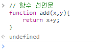
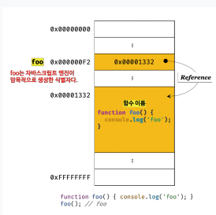
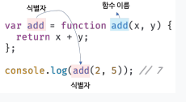
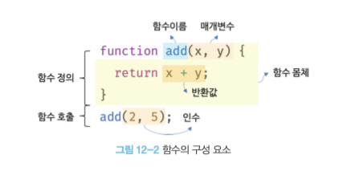

# 함수

## 12.1 함수란?

함수는 자바스크립트에서 가장 중요한 핵심 개념이다. 
또 다른 자바스크립트의 핵심 개념인 스코프, 실행 컨텍스트, 클로저, 생성자 함수에 의해 객체 생성, 
메서드 , this , 프로토타입 , 모듈화 등이 모두 함수와 깊은 관련이 있다.
따라서 함수는 자바스크립트를 정확히 이해하고 사용하기 위해 피해갈 수 없는 핵심 중의 핵심이라고 할 수 있다.


```javascript
function add(x,y) {
    return x+y;
}

add(2,5);
```

프로그래밍 언어의 함수는 일련의 과정을 문으로 구현하고 코드 블록으로 감싸서 하나의 실행 단위로 정의한 것이다. 

프로그래밍 언어의 함수도 입력을 받아서 출력을 보낸다/

## 12.2 함수를 사용하는 이유

함수는 필요할 때 여러 번 호출할 수 있다. 즉 실행 시점을 개발자가 결정할 수 있고 몇 번이든 재사용이 가능하다.
동일한 작업을 반복적으로 수행해야 한다면 같은 코드를 중복해서 여러 번 작성하는 것이 아니라 미리 정의된 함수를 재사용하는 것이 효율적이다.


## 12.3 함수 리터럴 

자바스크립트의 함수는 객체 타입의 값이다. 따라서 숫자 값을 숫자 리터럴로 생성하고 객체를 객체 리터럴로 생성하는 것처럼 
함수도 함수 리터럴로 생성할 수 있다. 함수 리터럴은 function 키워드,  함수 이름, 매개 변수 목록, 함수 몸채로 구성된다.

```javascript
// 변수에 함수 리터럴을 할당

var f = function add(x,y){
  return x+y;  
};
```

## 12.4 함수 정의

함수 정의란 함수를 호출하기 이전에 인수를 전달받을 매개변수와 실행할 문들, 그리고 반환할 값을 지정하는 것을 말한다.
정의된 함수는 자바스크립트 엔진에 의해 평가되어 함수 객체가 된다. 
함수를 정의하는 방법에는 4가지가 있다.

- 함수 선언문
- 함수 표현식
- Function 생성자 함수
- 화살표 함수 (ES6)

### 12.4.1  함수 선언문

```javascript
// 함수 선언문
function add(x,y){
    return x+y;
}

// 함수 참조
// console.dir 은 console.log 와는 달리 함수 객체의 프로퍼티까지 출력한다.
// 단, Node.js 환경에서는 console.log 와 같은 결과가 출력된다.
console.dir(add);

// 함수 호출
console.log(add(2,5)); // 7
```

함수 선언문은 함수 리터럴과 형태가 동일하다. 단, 함수 리터럴은 함수 이름을 생략할 수 있으나
함수 선언문은 함수 이름을 생략할 수 없다.

```javascript
// 함수 선언문은 함수 이름을 생략할 수 없다.
function (x,y){
    return x+y;
} // SyntaxError: Function statements require a function name

```


함수 선언문은 표현식이 아닌 문이다. 크롬 개발자 도구의 콘솔에서 함수 선언문을 실행하면 완료 값 undefined 가 출력된다.
함수 선언문이 만약 표현식인 문이라면 완료 값 undefined 대신 표현식이 평가되어 생성된 함수가 출력되어야 한다.





표현식이 아닌 문은 변수에 할당할 수 없다. 함수 선언문도 표현식이 아닌 문이므로 변수에 할당할 수 없다.
하지만 다음 예제를 실행해보면 함수 선언문이 변수에 할당되는 것처럼 보인다. 


```javascript
// 함수 선언문은 표현식이 아닌 문이므로 변수에 할당 할 수 없다.
// 하지만 함수 선언문이 변수에 할당되는 것처럼 보인다.
var add = function add(x,y){
    return x+y;
}

// 함수 호출
console.log(add,2,5);// 7
```

이렇게 동작하는 이유는 자바스크립트 엔진이 코드의 문맥에 따라 동일한 함수 리터럴을 표현식이 아닌
문인 함수 선언문으로 해석하는 경우와 표현식인 문인 함수 리터럴 표현식으로 해석하는 경우가 있기 때문이다.
함수 선언문은 함수 이름을 생략할 수 없다는 점을 제외하면 함수 리터럴과 형태가 동일하다. 
이는 함수 이름이 있는 기명 함수 리터럴은 함수 선언문 또는 함수 리터럴 표현식으로 해석될 가능성이 있다는 의미다. 

예를 들어, {} 은 블록문일 수도 있고 객체 리터럴일 수도 있다. 즉, {} 은 중의적 표현이다. 
자바스크립트 엔진은 {}을 코드 블록으로 해석할까? 객체 리터럴로 해석할까? {} 처럼 중의적인 코드는
코드의 문맥에 따라 해석이 달라진다.

기명 함수 리터럴도 중의적인 코드다. 따라서 코드의 문맥에 따라 해석이 달라질 수 있다.
자바스크립트 엔진은 함수 이름이 있는 함수 리터럴을 단독으로 사용하면 함수 선언문으로 해석하고,
함수 리터럴이 값으로 평가되어야 하는 문맥, 예를 들어 함수 리터럴을 변수에 할당하거나 피연산자로 사용하면
함수 리터럴 표현식으로 해석한다.




자바스크립트 엔진은 함수 선언문을 해석해 함수 객체를 생성한다.
이때 함수 이름은 함수 몸체 내부에서만 유효한 식별자이므로 함수 이름과는 별도로 생성된 함수 객체를 가리키는 식별자가 필요하다.
함수 객체를 가리키는 식별자가 없으면 생성된 함수 객체를 참조할 수없으므로 호출할 수도 없다.

따라서 자바스크리틉 엔진은 생성된 함수를 호출하기 위해 함수 이름과 동일한 이름의 식별자를 암묵적으로 생성하고,
거기에 함수 객체를 할당한다.

지금까지 살펴본 함수 선언문을 의사 코드로 살펴보면 다음과 같다.

```javascript
var add = function add(x,y){
    return x+y;
}

console.log(add(2,5));
```

함수는 함수 이름으로 호출하는 것이 아니라 함수 객체를 가리키는 식별자로 호출한다.
즉, 함수 선언문으로 생성한 함수를 호출한 것은 함수 이름 add가 아니라 자바스크립트 엔진이 암묵적으로 생성한 식별자 add 인것이다.
함수 이름과 변수 이름이 일치하므로 함수 이름으로 호출되는 듯하지만 사실은 식별자로 호출 된 것이다.



사실은 위 의사 코드가 바로 다음에 살펴볼 함수 표현식이다. 결론적으로 자바스크립트 엔진은 함수 선언문을 함수 표현식으로 변환해
함수 객체를 생성한다고 생각할 수 있다. 단, 함수 선언문과 함수 표현식이 정확히 동일하게 동작하는 것은 아니다. 

### 12.4.2 함수 표현식

자바스크립트의 함수는 객체 타입의 값이다. 자바스크립트의 함수는 값처럼 변수에 할당할 수도 있고
프로퍼티의 값이 될 수도 있으며 배열의 요소가 될 수도 있다. 이처럼 값의 성질을 갖는 객체를 일급 객체라 한다. 
자바스크립트의 함수는 일급 객체다. 함수가 일급 객체라는 것은 함수를 값처럼 자유롭게 사용할 수 있다는 의미다. 

함수는 일급 객체이므로 함수 리터럴로 생성한 함수 객체를 변수에 할당할 수 있다. 이러한 함수 정의 방식을 함수 표현식이라 한다.
함수 선언문으로 정의한 add 함수를 함수 표현식으로 바꿔서 정의하면 다음과 같다

```javascript
// 함수 표현식
var add = function (x,y){
    return x +y;
};

console.log(add(2,5)); // 7
```


```javascript
// 기명 함수 표현식
var add = function foo(x,y){
    return x+y;
}

// 함수 객첼르 가리키는 식별자로 호출
console.log(add(2,5)); // 7


// 함수 이름으로 호출하면 ReferenceError 가 발생한다.
// 함수 이름은 함수 몸체 내부에서만 유효한 식별자다.
console.log(foo(2,5)); // ReferenceError: foo is not defined
```


### 12.4.3 함수 생성 시점과 함수 호이스팅

```javascript
// 함수 참조
console.dir(add); // [Function: add]
console.dir(sub); // undefined

// 함수 호출
console.log(add(2,5)); // 7
console.log(sub(2,5)); // TypeError: sub is not a function


// 함수 선언문
function add(x,y){
    return x+y;
}

// 함수 표현식
var sub = function (x,y){
    return x-y;
};
```

함수 선언문으로 정의한 함수는 함수 선언문 이전에 호출할 수 있다. 그러나 함수 표현식으로
정의한 함수는 함수 표현식 이전에 호출할 수 없다. 
이는 함수 선언문으로 정의한 함수와 함수 표현식으로 정의한 함수의 생성 시점이 다르기 때문이다. 

모든  선언문이 그렇듯 함수 선언문도 코드가 한 줄씩 순차적으로 실행되는 시점인 런타임 이전에 자바스크립트 엔진에 의해 먼저 실행된다.

다시 말해, 함수 선언문으로 함수를 정의하면 런타임 이전에 함수 객체가 먼저 생성된다.

함수 표현식은 변수에 할당되는 값이 함수 리터럴인 문이다. 따라서 함수 표현식은 변수 선언문과 변수 할당문을 한 번에
기술한 축약 표현과 동일하게 동작한다. 
변수 선언은 런타임 이전에 실행되어 undefined 로 초기화되지만 변수 할당문의 값은 할당문이 실행되는 시점, 즉 런타임에 
평가되므로 함수 표현식의 함수 리터럴도 할당문이 실행된느 시저에 평가되어 함수 객체가 된다.

따라서 함수 표현식ㅇ르로 함수를 정의하면 함수 호이스팅이 발생하는 것이 아니라 변수 호이스팅이 발생한다. 

## 12.4.4 Function 생성자 함수

자바스크립트가 기본적으로 제공하는 빌트인 함수인 Function 생성자 함수에 매개변수 목록과 함수 몸체를 
문자열로 전달하면서 new 연산자와 함께 호출하면 함수 객체를 생성해 반환한다. 사실 new 연산자 없이 호출해도
결과는 동일하다.

#### 생성자 함수

`생성자 함수는 객체를 생성하는 함수를 말한다. 객체를 생성하는 방식은 객체 리터럴 이외에 다양한 방법이 있다.`

```javascript
var add = new Function('x','y','return x+y');

console.log(add(2,5));; // 7
```

Function 생성자 함수로 함수를 생성하는 방식은 일반적이지 않으며 바람직하지도 않다. 
Function 생성자 함수로 생성한 함수는 클로저를 생성하지 않는 등, 함수 선언문이나 함수 표현식으로 생성한 함수와 다르게 동작한다.

```javascript
var add1 = (function () {
    var a = 10;
    return function (x,y){
        return x+y+a;
    };
}());

console.log(add1(1,2)); // 13

var add2 = (function (){
    var a = 10;
    return new Function('x','y','return x+y+a');
}());

console.log(add2(1,2)); // ReferenceError: a is not defined
```

함수 선언문이나 함수 표현식으로 생성한 함수와 Function 생성자 함수로 생성한 함수가 동일하게 동작하지 않는다는 데 주목하자.


### 12.4.5 화살표 함수

ES6 에서 도입된 화살표 함수는 function 키워드 대신 화살표 => 를 사용해 좀 더 간략한 방법으로 함수를 선언할 수 있다.
화살표 함수는 항상 익명 함수로 정의한다. 

```javascript
// 화살표 함수
const add = (x,y) => x+y;
console.log(add(2,5)); // 7
```

화살표 함수는 기존의 함수 선언문 또는 함수 표현식을 완전히 대체하기 위해 디자인된 것은 아니다. 화살표 함수는
기존의 함수보다 표현만 간략한 것이 아니라 내부 동작 또한 간략화되어 있다.-

화살표 함수는 생성자 함수로 사용할 수 없으며, 기존 함수와 this 바인딩 방식이 다르고, prototype 프로퍼티가 
없으며 arguments 객체를 생성하지 않는다. 

## 12.5 함수 호출

### 12.5.1 매개변수와 인수

함수를 실행하기 위해 필요한 값을 함수 외부에서 함수 내부로 전달할 필요가 있는 경우, 매개변수를 통해
인수를 전달한다. 인수는 값으로 평가될 수 있는 표현식이어야 한다. 
인수는 함수를 호출할 때 지정하며, 개수와 타입에 제한이 없다.

```javascript
// 함수 선언문
function add(x,y) {
    return x+y;
}

// 함수 호출
// 인수 1과 2가 매개변수 x와 y에 순서대로 할당되고 함수 몸체의 문들이 실행된다.
var result = add(1,2);
```

매개변수는 함수를 정의할 때 선언하며, 함수 몸체 내부에서 변수와 동일하게 취급된다.
즉, 함수가 호출되면 함수 몸체 내에서 암묵적으로 매개변수가 생성되고 일반 변수와 마찬가지로 undefined로 초기화된 이후
인수가 순서대로 할당된다.




함수는 매개변수의 개수와 인수의 개수가 일치하는지 체크하지 않는다.

즉, 함수를 호출할 때 매개변수의 개수만큼 인수를 전달하는 것이 일반적이지만 그렇지 않은 경우에도 에러가 발생하지는 않는다.
인수가 부족해서 인수가 할당되지 않은 매개변수의 값은 undefined 다. 

```javascript
function add(x,y){
    return x+y;
}

console.log(add(2));
```

위 예제의 매개변수 x에는 인수 2가 전달되지만, 매개변수 y에는 전달할 인수가 없다. 

따라서 매개변수 y는 undefined 로 초괴화된 상태 그대로다. 따라서 함수 몸체의 문 x+y 는 2 + undefined와 같으므로 
NaN 이 반환된다.

매개변수보다 인수가 더 많은 경우 초과된 인수는 무시된다.

```javascript
function add(x,y){
    return x+y;
}

console.log(add(2,5,10));
```

사실 초과된 인수는 그냥 버려지는 것이 아니다. 
모든 인수는 암묵적으로 arguments 객체의 프로퍼티로 보관된다.

```javascript
function add(x,y){
    console.log(arguments);
    // [Arguments] { '0': 2, '1': 5, '2': 10 }
    return x+y;
}

add(2,5,10);
```

arguments 객체는 함수를 정의할 때 매개변수 개수를 확정할 수 없는 가변 인자 함수를 구현할 때 유용하게 사용된다. 


### 12.5.2 인수 확인


- 자바스크립트 함수는 매개변수와 인수의 개수가 일치하는지 확인하지 않는다.
- 자바스크립트는 동적 타입 언어다. 따라서 자바스크립트 함수는 매개변수의 타입을 사전에 지정할 수 없다.

따라서 자바스크립트의 경우 함수를 정의할 때 적절한 인수가 전달되었는지 확인할 필요가 있다.

함수 내부에서 적절한 인수가 전달되었는지 확인하더라도 부적절한 호출을 사전에 방지할 수는 없고
에러는 런타임에 발생하게 된다. 따라서 타입스크립트와 같은 정적 타입을 선언할 수 있는 자바스크립트의 상위 확장을 도입해서
컴파일 시점에 부적절한 호출을 방지할 수 있게 하는 것도 하나의 방법이다.

arguments 객체를 통해 인수 개수를 확인할 수도 있지만 또는 인수가 전달되지 않은 경우 단축 평가를 사용해 매개변수에
기본값을 할당하는 방법도 있다.

```javascript
function add(a,b,c){
    a = a || 0;
    b = b || 0;
    c = c || 0;
    return a + b + c;
}

console.log(add(1,2,3)); // 6
console.log(add(1,2)); // 3
console.log(add(1)); // 1
console.log(add()); // 0
```

ES6 에서 도입된 매개변수 기본값을 사용하면 함수 내에서 수행하던 인수 체크 및 초기화를 간소화할 수 있다.
매개변수 기본값은 매개변수에 인수를 전달하지 않았을 경우와 undefined 를 전달한 경우에만 유효하다.


### 12.5.3 매개변수의 최대 개수

ECMAScript 사양에서는 매개변수의 최대 개수에 대해 명시적으로 제한하고 있지 않다.
하지만 물리적 한계는 있으므로 자바스크립트 엔진마다 매개변수의 최대 개수에 대한 제한이 있겠지만
충분히 많은 매개변수를 지정할 수 있다. 그렇다면 매개변수는 최대 몇 개까지 사용하는 것이 좋을까?


함수 외부에서 함수 내부로 전달할 객체를 함수 내부에서 변경하면 함수 외부의 객체가 변경되는 부수 효과가 발생한다는 것이다.


### 12.5.4 반환문

함수는 return 키워드와 표현식으로 이뤄지 반환문을 상요해 실행 결과를 함수 외부로 반환 할 수 있다.


### 12.7.4 콜백 함수

```javascript
function repeat(n){
    for(var i=0; i<n; i++){
        console.log(i);
    }
}

repeat(5); // 0 1 2 3 4
```

repeat 함수는 매개변수를 통해 전달받은 숫자만큼 반복하며 console.log(i)를 호출한다.
이때 repeat 함수는 console.log(i)에 강하게 의존하고 있어 다른 일을 할 수 없다.
따라서 만약 repeat 함수의 반복문 내부에서 다른 일을 하고 싶다면 함수를 새롭게 정의해야 한다.

```javascript
// n만큼 어떤 일을 반복한다.
function repeat1(n){
    // i를 출력한다.
    for (var i=0; i<n; i++){
        console.log(i);
    }
}

repeat1(5); // 0 1 2 3 4

// n만큼 어떤 일을 반복한다.
function repeat2(n){
    for(var i=0; i<n; i++){
        if(i%2) console.log(i);
    }
}

repeat2(5); // 1 3
```