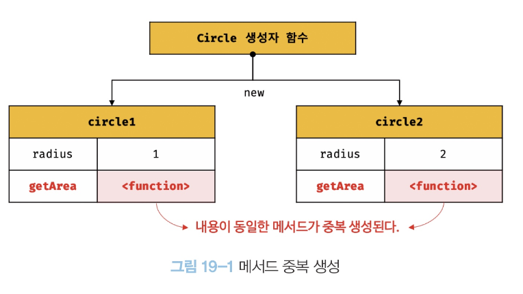
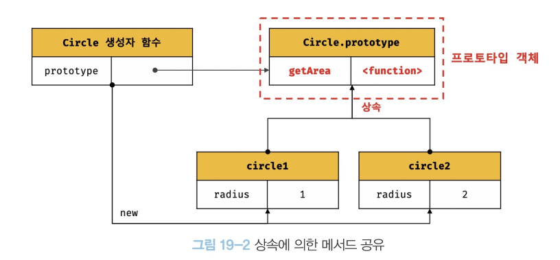
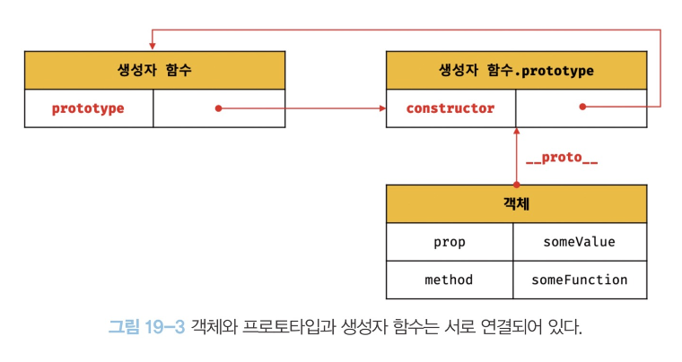
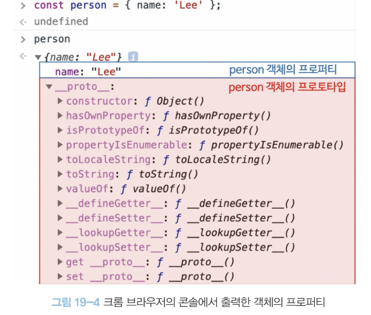

# 프로토타입

## 19.1 객체지향 프로그래밍

객체지향 프로그래밍은 프로그램을 명령어 또는 함수의 목록으로 보는 
전통적인 명령형 프로그래밍의 절차지향적 관점에서 벗어나
여러 개의 독립적인 단위, 즉 객체의 집합으로 프로그램을
표현하려는 프로그래밍 패러다임을 말한다.

객체지향 프로그래밍은 실세계의 실체을 인식하는
철학적 사고를 프로그래밍에 접목하려는 시도에서 시작한다.

실체는 특징이나 성질을 나타내는 속성을 가지고 있고, 
이를 통해 실체를 인식하거나 구별할 수있다.

다양한 속성 중에서 프로그램에 필요한 속성만 간추려 내어
표현하려는 것을 추상화라 한다.

```javascript
// 이름과 주소 속성을 갖는 객체
const person = {
    name : "Lee",
    address : "Seoul"
};

console.log(person);
```

프로그래머는 이름과 주소 속성으로 표현된 객체인 person을 다른
객체와 구별하여 인식할 수 있다. 이처럼 속성을 통해
여러 개의 값을 하나의 단위로 구성한 복합적인 자료구조를 객체라 하며,
객체지향 프로그래밍은 독립적인 객체의 집합으로 프로그램을
표현하려는 프로그래밍 패러다임이다.

```javascript
const circle = {
    radius : 5,

    getDiameter(){
        return 2*this.radius;
    },

    getPerimeter() {
        return 2*Math.PI*this.radius;
    },

    getArea() {
        return Math.PI * this.radius **2;
    }
};

console.log(circle);
console.log(circle.getDiameter());
console.log(circle.getPerimeter());
console.log(circle.getArea());
```

객체지향 프로그래밍은 객체의 상태를 나타내는 데이터와 상태 데이터를
조작할 수 있는 동작을 하나의 논리적인 단위로 묶어 생각한다.
따라서 객체는 상태 데이터와 동작을 하나의 논리적인 단위로
묶은 복합적인 자료구조라고 할 수 있다. 

이때 객체의  상태 데이터를 프로퍼티, 동작을 메서드라 부른다.


## 19.2 상속과 프로토타입

상속은 객체지향 프로그래밍의 핵심 개념으로, 
어떤 객체의 프로퍼티 또는 메서드를 다른 객체가 상속받아
그대로 사용할 수 있는 것을 말한다.

자바스크립트는 프로토타입을 기반으로 상속을 구현하여
불필요한 중복을 제거한다. 

중복을 제거하는 방법은 기존의 코드를 적극적으로 재사용하는 것이다.
코드 재사용은 개발 비용을 현저히 줄일 수 있는 잠재력이 있으므로
매우 중요하다. 

```javascript
// 생성자 함수
function Circle(radius) {
    this.radius = radius;
    this.getArea = function (){
        return Math.PI * this.radius ** 2;
    }
}

// 반지름이 1인 인스턴스 생성
const circle1 = new Circle(1);

// 반지름인 2인 인스턴스 생성
const circle2= new Circle(2);

// Circle 생성자 함수는 인스턴스를 생성할 때마다 동일한 동작을 하는
// getArea 메서드를 중복 생성하고 모든 인스턴스가 중복 소유한다.
// getArea 메서드는 하나만 생성하여 모든 인스턴스가 공유해서 사용하는 것이 바람직하다.
console.log(circle1.getArea == circle2.getArea); // false

console.log(circle1.getArea()); // 3.141592653589793
console.log(circle2.getArea()); // 12.566370614359172
```

위 예제의 생성자 함수는 문제가 있다.

Circle 생성자 함수가 생성하는 모든 객체는 
radius 프로퍼티와 getArea 메서드를 갖는다.
getArea 메서드는 모든 인스턴스가 동일한 내용의 메서드를 
사용하므로 단 하나만 생성하여 모든 인스턴스가 공유해서 
사용하는 것이 바람직하다.



동일한 생성자 함수에 의해 생성된 모든 인스턴스가 동일한
메서드를 중복 소유하는 것은 메모리를 불필요하게 낭비한다.

또한 인스턴스를 생성할 때마다 메서드를 생성하므로
퍼포먼스에도 악영향을 준다. 
만약 10갸의 인스턴스를 생성하면 내용이 동일한
메소드도 10개 생성된다.

상속을 통해 불필요한 중복을 제거해보자.

자바스크립트는 프로토타입을 기반으로 상속을 구현한다.



Circle 생성자 함수가 생성한 모든 인스턴스는 자신의
프로토타입, 즉 상위 (부모) 객체 역할을 하는 Circle.protype 의
모든 프로퍼티와 메서드를 상속받는다.

getArea 메서드느 단 하나만 생성되어 프로토타입인 Circle.prototype
의 메서드로 할당되어 있다. 

따라서 Circle 생성자 함수가 생성하는 모든 인스턴스는
getArea 메서드를 상속받아 사용할 수 있다.
즉, 자신의 상태를 나타내는 radius 프로퍼티만 
개별적으로 소유하고 내용이 동일한 메서드는 상속을 통해
공유하여 사용하는 것이다. 

상속은 코드의 재사용이란 관점에서 매우 유용하다.
생성자 함수가 생성할 모든 인스턴스가 공통적으로
사용할 프로퍼티나 메서드를 프로토타입에 미리 구현해 두면
생성자 함수가 생성할 모든 인스턴스는 별도의 구현없이
상위 객체인 프로토타입의 자산을 공유하여 사용할 수 있다.


## 19.3 프로토타입 객체
프로토타입 객체란 객체지향 프로그래밍의 근간을 이루는 
객체 간  상속을 구현하기 위해 사용된다.

프로토타입은 어떤 객체의 상위 객체의 역할을 하는 객체로서
다른 객체에 공유 프로퍼티를 제공한다. 
프로토타입을 상속받은 하위 객체는 
상위 객체의 프로퍼티를 자신의 프로퍼티 처럼 자유롭게
사용할 수 있다.

모든 객체는 [[Prototype]]이라는 내부 슬롯을 가지며,
이 내부 슬롯의 값은 프로토타입의 참조다. 

[[Prototype]] 에 저장되는 프로토타입은 객체 생성 방식에
의해 결정된다. 즉, 객체가 생성될 때, 객체
생성 방식에 따라 프로토타입이 결정되고 
[[Prototype]]에 저장된다.

예를 들어, 객체 리터럴에 의해 생성된 객체의
프로토타입은 Object.prototype 이고 생성자 함수에 의해
생성된 객체의 프로토타입은 생성자 함수의 prototype
프로퍼티에 바인딩되어 있는 객체다. 

모든 객체는 하나의 프로토타입을 갖는다. 
그리고 모든 프로토타입은 생성자 함수와 연결되어 있다.



[[Prototype]] 내부 슬롯에는 직접 접근할 수 없지만,
위 그림처럼 __proto__ 접근자 프로퍼티를 통해
자신의 프로토타입, 즉 자신의 [[Prototype]] 내부 슬롯이
가리키는 프로토타입에 간접적으로 접근할 수 있다. 
그리고 프로토타입은 자신의 constructor 프로퍼티를 통해
생성자 함수에 접근 할 수 있고, 생성자 함수는 
자신의 prototype 프로퍼티를 통해 프로토타입에 접근할 수 있다.

### 19.3.1 __proto__ 접근자 프로퍼티

모든 객체는 __proto__ 접근자 프로퍼티를 통해
자신의 프로토타입, 즉 [[Prototype]] 내부 슬롯에
간접적으로 접근할 수 있다. 




#### __proto__ 는 접근자 프로퍼티다.

```javascript
const obj = {};
const parent = {x :1};


// getter 함수인 get__proto__  가 호출되어 obj 객체의 프로토타입을 취득
obj.__proto__;

// setter 함수인 set__proto__ 가 호출도어 obj 객체의 프로토타입을 교체
obj.__proto__ = parent;

console.log(obj.x); // 1
```

#### __proto__ 접근자 프로퍼티는 상속을 통해 사용된다.


#### __proto__ 접근자 프로퍼티를 통해 프로토타입에 접근하는 이유

[[Prototype]]  내부 슬롯의 값, 즉 프로토타입에 접근하기 위해
접근자 프로퍼티를 사용하는 이유는 상호 참조에 의해
프로토타입 체인이 생성되는 것을 방지하기 위해서다.

프로토타입 체인은 단방향 링크드 리스트로 구현되어야 한다.


#### __proto__ 접근자 프로퍼티를 코드 내에서 직접 사용하는 것은 권장하지 않는다.

### 19.3.2 함수 객체의 prototype 프로퍼티

함수 객체만이 소유하는 prototype 프로퍼티는 생성자 함수가
생성할 인스턴스의 프로토타입을 가리킨다.

