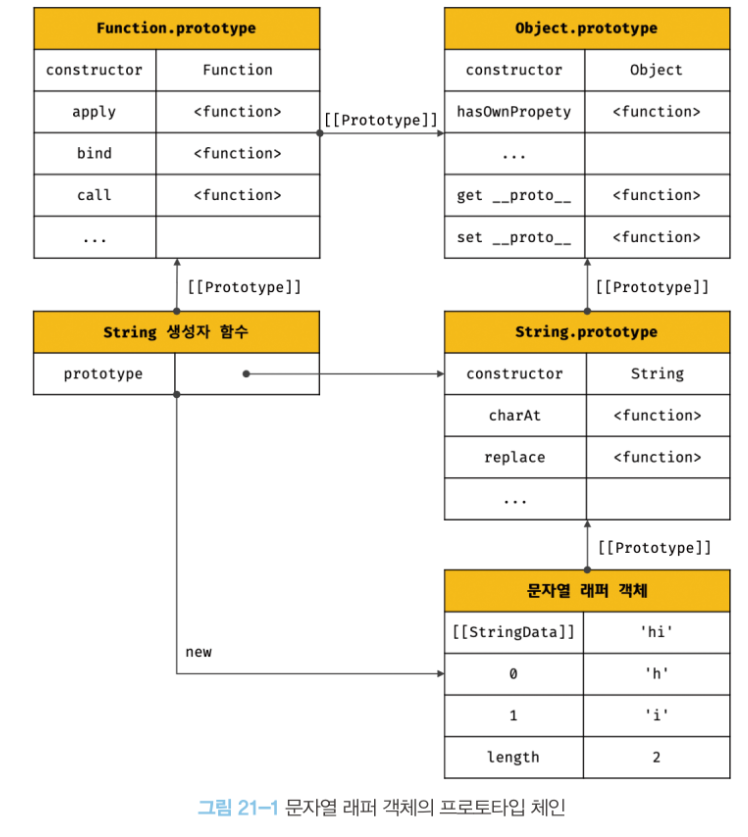

# 빌트인 객체

## 21.1 자바스크립트 객체의 분류

자바스크립트 객체는 다음과 같이 크게 3개의 객체로 분류할 수 있다.

- 표준 빌트인 객체
  - ECMAScript 사양에 정의된 객체를 말하며, 애플리케이션 전역의 공통 기능을 제공한다. 
  - 표준 빌트인 객체는 ECMAScript 사양에 정의된 객체이므로, 자바스크립트 실행 관경과 관계없이 언제나 사용할 수 있다.
  - 표준 빌트인 객체는 전역 객체의 프로퍼티로서 제공된다. 따라서 별도의 선언 없이 전역 변수처럼 언제나 참조할 수 있다.
- 호스트 객체
  - 호스트 객체는 ECMAScript 사양에 정의되어 있지 않지만 자바스크립트 실행 환경에 추가로 제공하는 객체를 말한다.
  - 브라우저 환경에서는 DOM, BOM , Canvas , XMLHTTPRequest , fetch , requestAnimationFrame , SVG , Web Storage ,
  Web Component , Web Worker 와 같은 클라이언트 사이드 Web API를 호스트 객체로 제공하고, Node.js 환경에서는 Node.js 고유의 API를
  호스트 객체로 제공한다.
- 사용자 정의 객체
  - 사용자 정의 객체는 표준 빌트인 객체와 호스트 객체처럼 기본 제공되는 객체가 아닌 사용자가 직접 정의한 객체를 말한다.


## 21.2 표준 빌트인 객체

자바스크립트는 Object , String , Number , Boolean, Symbol , Date , Math , RegExp , Array , Map/Set 
, WeakMap/WeakSet , Function , Promise , Reflect , Proxy , JSON , Error 등
40여 개의 표준 빌트인 객체를 제공한다.


Math , Reflect ,  JSON을 제외한 표준 빌트인 객체는 모두 인스턴스를 생성할 수 있는 생성자 함수 객체다.

생성자 함수 객체인 표준 빌트인 객체는 프로토타입 메서드와 정적 메서드를 제공하고 생성자 함수 객체가 아닌 표준 빌트인 객체는 정적 메서드만
제공한다.

예를 들어, 표준 빌트인 객체인 String , Number , Boolean, Function , Array , Date 는 생성자 함수로 호출하여 인스턴스를
생성할 수 있다.

```javascript
// String 생성자 함수에 의한 String 객체 생성

const strObj = new String('Lee'); // String {"Lee"}
console.log(typeof strObj); // object

const numObj = new Number(123);
console.log(typeof numObj);

const boolObj = new Boolean(true);
console.log(typeof  boolObj);

const func = new Function('x','return x * x');
console.log(typeof func);

const arr = new Array(1,2,3);
console.log(typeof arr);

const regExp = new RegExp(/ab+c/i);
console.log(typeof regExp);

const date = new Date();
console.log(typeof date); // object
```

생성자 함수인 표준 빌트인 객체가 생성한 인스턴스의 프로토타입은 표준 빌트인 객체의 prototype 프로퍼티에 바인딩된 객체다.

예를 들어, 표준 빌트인 객체인 String 을 생성자 함수로서 호출하여 생성한 String 인스턴스의 프로토타입은 String.prototype 이다.

```javascript
// String 생성자 함수에 의한 String 객체 생성
const strObj = new String('Lee'); // String {"Lee"}

// String 생성자 함수를 통해 생성한 strObj 객체의 프로토타입은 String.prototype 이다.
console.log(Object.getPrototypeOf(strObj) === String.prototype); // true
```

표준 빌트인 객체의 prototype 프로퍼티데 바인딩된 객체 (예를 들어,  String.prototype)는 다양한 기능의
빌트인 프로토타입 메서드를 제공한다. 그리고 표준 빌트인 객체는 인스턴스 없이도 호출 가능한 빌트인 정적 메서드를 제공한다.

예를 들어, 표준 빌트인 객체인 Number 의 prototype 프로퍼티에 바인딩된 객체, Number.prototype 은 다양한 기능의 빌트인
프로토타입 메서드를 제공한다. 이 프로토타입 메서드는 모든 Number 인스턴스가 상속을 통해 사용할 수 있다.
그리고 표준 빌트인 객체인 Number는 인스턴스 없이 정적으로 호출할 수 있는 정적 메서드를 제공한다.

```javascript
// number 생성자 함수에 의한 Number 객체 생성
const numObj = new Number(1.5); // Number {1.5}


// toFixed 는 Number.prototype의 프로토타입 메서드다.
// Number.prototype.toFixed 는 소수점 자리를 반올림하여 문자열로 반환한다.
console.log(numObj.toFixed()); // 2

// isInteger 는 Number 의 정적 메서드다.
// Number.isInteger 는 인수가 정수인지 검사하여 그 결과를 Boolean 으로 반환한다.
console.log(Number.isInteger(0.5)); // false
```


## 21.3 원시값과 래퍼 객체

문자열이나 숫자, 불리언 등의 원식값이 있는데도 문자열,숫자, 불리언 객체를 생성하는 String , Number , Boolean 등의 표준 빌트인 
생성자 함수가 존재하는 이유는 무엇일까?

원시 값은 객체가 아니므로 프로퍼티나 메서드를 가질 수 없는데도 원시값인 문자열이 마치 객체처럼 동작한다.

```javascript
const str  = 'hello';

// 원시 타입인 문자열이 프로퍼티와 메서드를 갖고 있는 객체처럼 동작한다.
console.log(str.length); // 5
console.log(str.toUpperCase()); // HELLO
```

이는 원시값인 문자열,숫자, 불리언 값의 경우 이들 원시값에 대해 마치 객체처럼  마침표 표기법으로 접근하면 
자바스크립트 엔진이 일시적으로 연관된 객체로 변환해 주기 때문이다.

즉, 원시값을 객체처럼 사용하면 자바스크립트 엔진은 암묵적으로 연관된 객체를 생성하여 생성된 객체로
프로퍼티에 접근하거나 메서드를 호출하고 다시 원시값으로 되돌린다.

이처럼 문자열 , 숫자, 불리언 값에 대해 객체처럼 접근하면 생성되는 임시 객체를 래퍼 객페라 한다.

예를 들어, 문자열에 대해 마침표 표기법으로 접근하면 그 순간 래퍼 객체인 String 생성자 함수의 인스턴스가 생성되고
문자열은 래퍼 객페의 [[StringData]] 내부 슬롯에 할당된다.

```javascript
const str  = 'hello';

// 원시 타입인 문자열이 프로퍼티와 메서드를 갖고 있는 객체처럼 동작한다.
console.log(str.length); // 5
console.log(str.toUpperCase()); // HELLO
```

이때 문자열 래퍼 객체인 String 생성자 함수의 인스턴스는 String.prototype 의 메서드를 상속받아 사용할 수 있다.



그 후 래퍼 객체의 처리가 종료되면 래퍼 객페의 [[StringData]] 내부 슬롯에 할당된 원시값으로 원래의 상태, 즉 식별자가
원시값을 갖도록 되돌리고 래퍼 객체는 가비지 컬렉션의 대상이 된다.

```javascript
const str  = 'hello';

// 식별자 str 은 암묵적으로 생성된 래퍼 객체를 가리킨다.
// 식별자 str의 값 'hello'는 래퍼 객체의 [[StringData]] 내부 슬롯에 할당된다.
// 래퍼 객체에 name 프로퍼티가 동적 추가된다.
str.name = 'Lee';

// 식별자 str은 다시 원래의 문자열,. 즉 래퍼 객체의 [[StringData]] 내부 슬롯에 할당된 원시값을 갖는다.
// 이때 위에서 생성된 래퍼 객체는 아무도 참조하지 않는 상태이므로 가비지 컬렉션의 대상이 된다.


// 식별자 str은 새롭게 암묵적으로 생성된 래퍼 객체를 가리킨다.
// 새롭게 생성된 래퍼 객체에는 name 프로퍼티가 존재하지 않는다.
console.log(str.name); // undefined

// 식별자 str은 다시 원래의 문자열, 즉 래퍼 객체의 [[StringData]] 내부 슬롯에 할당된 원시값을 갖는다.
// 이때 위에서 생성된 래퍼 객체는 아무도 참조하지 않는 상태이므로 가비지 컬렉션의 대상이 된다.
console.log(typeof str, str); // string , hello
```

숫자 값도 마찬가지다. 숫자 값에 대해 마침표 표기법으로 접근하면 그 순간 래퍼 객체인 Number 생성자 함수의 인스턴스가 생성되고
숫자는 래퍼 객체의 [[NumberData]] 내부 슬롯에 할당된다. 
이때 래퍼 객체인 Number 객체는 당연히 Number.prototype 의 메서드를 상속받아 사용할 수 있다. 
그후 , 래퍼 객체의 처리가 종료되면 래퍼 객체의 [[NumberData]] 내부 슬롯에 할당된 원시값을 되돌리고 래퍼 객체는 
가비지 컬렉션의 대상이 된다.

```javascript
const num = 1.5;

// 원시 타입인 숫자가 래퍼 객체인 Number 객체로 변환된다.
console.log(num.toFixed()); // 2

// 래퍼 객체로 프로퍼티에 접근하거나 메서드를 호출 한 후 , 다시 원시값으로 되돌린다.
console.log(typeof num , num); // number 1.5
```

불리언 값도 문자열이나 숫자와 마찬가지이지만 불리언 값으로 메서드를 호출하는 경우는 없으므로 그다지 유용하지는 않다.

문자열 , 숫자, 불리언, 심벌은 암묵적으로 생성되는 래퍼 객체에 의해 마치 객체처럼 사용할 수 있으며, 표준 빌트인 객체인 String ,Number,
Boolean, Symbol 의 프로토타입 메서드 또는 프로퍼티를 참조할 수 있다. 따라서 String , Number, Boolean 생성자 함수를 
new 연산자와 함께 호출하여 문자열, 숫자, 불리언 인스턴스를 생성할 필요가 없으며 권장하지도 않는다. 

문자열, 숫자, 불리언, 심벌 이외의 원시값 , 즉 null 과 undefined 는 래퍼 객체를 생성하지 않는다. 따라서 null 과 undefined 값을
객체처럼 사용하면 에러가 발생한다.


## 21.4 전역 객체

전역 객체는 코드가 실행되기 이전 단계에 자바스크립트 엔진에 의해 어떤 객체보다도 먼저 생성되는 특수한 객체이며,
어떤 객체에도 속하지 않은 최상위 객체다.

전역 객체는 자바스크립트 환경에 따라 지칭하는 이름이 제각각이다. 브라우저 환경에서는 window(또는 self, this, frames) 가
전역 객체를 가리키지만 Node.js 환경에서는 global이 전역 객체를 가리킨다.

전역 객체는 표준 빌트인 객체와 환경에 따른 호스트 객체 그리고 var 키워드로 선언한 전역 변수와 전역 함수를 프로퍼티로 갖는다.

즉, 전역 객체는 계층적 구조상 어떤 객체에도 속하지 않는 모든 빌트인 객체(표준 빌트인 객체와 호스트 객체)의 최상위 객체다.
전역 객체가 최상위 객체라는 것은 프로토타입 상속 관계상에서 최상위 객체라는 의미가 아니다.

전역 객체 자신은 어떤 객체의 프로퍼티도 아니며 객체의 계층적 구조상 표준 빌트인 객체와 호스트 객체를 프로퍼티로 소유한다는 것을 말한다.


전역 객체는 특징은 다음과 같다.

- 전역 객체는 개발자가 의도적으로 생성할 수 없다. 즉 , 전역 객체를 생성할 수 있는 생성자 함수가 제공되지 않는다.
- 전역 객체의 프로퍼티를 참조할 때 window (또는 global) 를 생략할 수 있다.
- 전역 객체는 Object , String , Number , Boolean , Function , Array , RegExp , Date , Math, Promise 같은 모든 표준 빌트인 객체를 프로퍼티
로 가지고 있다.
- 자바스크립트 실행 환경(브라우저 환경 또는 Node.js 환경)에 따라 추가적으로 프로퍼티와 메서드를 갖는다. 브라우저 환경에서는 DOM, BOM ,
Canvas, XMLHtpRequest , fetch , requestAnimationFrame, SVG , Web Storage , Web Component , Web Worker 같은 클라이언트 사이드
Web API를 호스트 객체로 제공하고 Node.js 환경에서는 Node.js 고유의 API를 호스트 객체로 제공한다.
- var 키워드로 선언한 전역 변수와 선언하지 않은 변수에 값을 할당한 암묵적 전역 , 그리고 전역 함수는 전역 객체의 프로퍼티가 된다.
```javascript
var foo = 1;
console.log(window.foo); // 1

bar = 2;
console.log(window.bar); // 2

function baz() {return 3};
console.log(window.baz()); // 3
```
- let 이나 const 키워드로 선언한 전역 변수는 전역 객체의 프로퍼티가 아니다. 즉, window.foo 와 같이 접근할 수 없다.
let 이나 const 키워드로 선언한 전역 변수는 보이지 않는 개념적인 블록 (전역 렉시컬 환경의 선언적 환경 레코드 )내에 존재하게 된다.

```javascript
let foo = 123;
console.log(window.foo); // undefined
```

- 브라우저 환경의 모든 자바스크립트 코드는 하나의 전역 객체 window를 공유한다. 여러 개의 script 태그를 통해 자바스크립트 코드를 
분리해도 하나의 전역 객체 window를 공유하는 것은 변함이 없다. 이는 분리되어 있는 자바스크립트 코드가 하나의 전역을 공유한다는 의미다.

전역 객체는 몇 가지 프로퍼티와 메서드를 가지고 있다. 전역 객체의 프로퍼티와 메서드는 전역 객체를 가리키는 식별자, 즉 
window 나 global 을 생략하여 참조/호출 할 수 있으므로 전역 변수와 전역 함수처럼 사용할 수 있다.

### 21.4.1 빌트인 전역 프로퍼티 

빌트인 전역 프로퍼티는 전역 객체의 프로퍼티를 의미한다. 주로 애플리케이션 전역에서 사용하는 값을 제공한다.

#### Infinity

Infinity 프로퍼티는 무한대를 나타내는 숫자값 Infinity 를 갖는다.

```javascript
// 전역 프로퍼티는 window를 생략하고 참조할 수 있다.
console.log(window.Infinity === Infinity); // true

// 양의 무한대
console.log(3/0); // Infinity
// 음의 무한대
console.log(-3/0); // -Infinity

// Infinity 는 숫자값이다.
console.log(typeof Infinity); // number
```

#### NaN

NaN 프로퍼티는 숫자가 아님(Not-a-Number)을 나타내는 숫자값 NaN을 갖는다.
NaN 프로퍼티는 Number.NaN 프로퍼티와 같다.

```javascript
console.log(window.NaN);; // NaN

console.log(Number('xyz')); // NaN
console.log(1 * 'string'); // NaN
console.log(typeof NaN); // number
```

#### undefined

undefined 프로퍼티는 원시 타입 undefined 를 값으로 갖는다.

```javascript
console.log(window.undefined); // undefined

var foo;
console.log(foo); // undefined
console.log(typeof undefined); // undefined
```

### 21.4.2 빌트인 전역 함수

빌트인 전역 함수는 애플리케이션 전역에서 호출할 수 있는 빌트인 함수로서 전역 객체의 메서드다.

#### eval 

eval 함수는 자바스크립트 코드를 나타내는 문자열을 인수로 전달받는다.
전달 받은 문자열 코드가 표현식이라면 eval 함수는 문자열 코드를 런타임에 평가하여 값을 생성하고, 전달받은
인수가 표현식이 아닌 문이라면 eval 함수는 문자열 코드를 런타임에 실행한다. 문자열 코드가 여러 개의 문으로 이루어져 있다면
모든 문을 실행한다.

```javascript
/**
*  @param {string} coce - 코드를 나타내는 문자열
 *  @returns {*} 문자열 코드를 평가/실행한 결과값
*/
eval(code)
```


### 21.4.3 암묵적 전역

```javascript
var x = 10; // 전역 변수

function foo () {
    // 선언하지 않은 식별자에 값을 할당
    y = 20; // window.y = 20;
}

foo();

// 선언하지 않은 식별자 y를 전역에서 참좔 수 있다.
console.log(x+y);//30
```

foo 함수 내의 y는 선언하지 않은 식별자다. 따라서 y = 20이 실행되면 참조 에러가 발생할 것처럼 보인다.
하지만 선언하지 않은 식별자 y는 마치 선언된 전역 변수처럼 동작한다. 이는 선언하지 않은 식별자에 값을 할당하면 
전역 객체의 프로퍼티가 되기 때문이다.

foo 함수가 호출되면 자바스크립트 엔진은 y 변수에 값을 할당하기 위해 먼저 스코프 체인을 통해 선언된 변수인지 확인한다.

이때 foo 함수의 스코프와 전역 스코프 어디에사도 y 변수의 선언을 찾을 수 없으므로 참조 에러가 발생한다.
하지만 자바스크립트 엔진은 y = 20 을 window.y = 20 으로 해석하여 전역 객체에 프로퍼티를 동적 생성한다. 
결국 y는 전역 객체의 프로퍼티가 되어 마치 전역 변수처럼 동작한다. 이러한 현상을 암묵적 전역 이라 한다.

하지만 y는 변수 선언 없이 단지 전역 객체의 프로퍼티로 추가되었을 뿐이다. 
따라서 y는 변수가 아니다. y는 변수가 아니므로 변수 호이스팅이 발생하지 않는다.

```javascript
// 전역 변수 x는 호이스팅이 발생한다.
console.log(x);
// 전역 변수가 아니라 단지 전역 객체의 프로퍼티인 y는 호이스팅이 발생하지 않는다.
console.log(y);

var x = 10; // 전역 변수

function foo (){
    // 선언하지 않은 식별자에 값을 할당
    y = 20; // window.y  = 20;
}
foo();

// 선언하지 않은 식별자 y를 전역에서 참조할 수 있다.
console.log(x+y);
```

또한 변수가 아니라 단지 프로퍼티인 y는 delete 연산자로 삭제할 수 있다. 
전역 변수는 프로퍼티이지만 delete 연산자로 삭제할 수 없다.