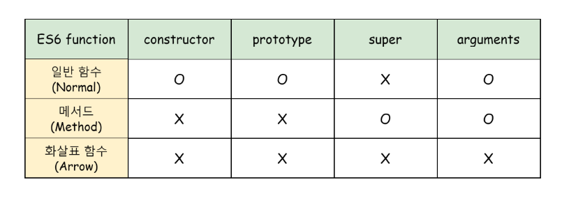

# ES6 함수의 추가 기능

## 26.1 함수의 구분

ES6 이전까지 자바스크립트의 함수는 별다른 구분 없이 다양한 목적으로 사용되었다. 
자바스크립트의 함수는 일반적인 함수로서 호출할 수도 있고, new 연산자와 함께 호출하여 인스턴스를 생성할  수 있는
생성자 함수로서 호출할 수도 있으며, 객체에 바인딩되어 메서드로서 호출할 수도 있다.
이는 언뜻 보면 편리한 것 같지만 실수를 유발시킬 수 있으면 성능 면에서도 손해다.

```javascript
var foo = function (){
    return 1;
};

// 일반적인 함수로서 호출
foo(); // 1

// 생성자 함수로서 호출
new foo();


// 메서드로서 호출
var obj = {foo : foo};
obj.foo();
```

이처럼 ES6 이전의 함수는 사용 목적에 따라 명확히 구분되지 않는다. 즉, ES6 이전의 모든 함수는 일반 함수로서 호출할 수 있는 것은
물론 생성자 함수로서 호출할 수 있다. 다시 말해, ES6 이전의 모든 함수는 callable 이면서 constructor 이다.

```javascript
var foo = function (){};

foo();
new foo();
```

주의할 것은 ES6 이전에 일반적으로 메서드라고 부르던 객체에 바인딩된 함수도 callable 이며 constructor 라는 것이다.

```javascript
var obj = {
    x : 10,
    f : function () { return this.x;}
};

console.log(obj.f()); // 10

var bar = obj.f;
console.log(bar()); // undefined


console.log(new obj.f()); 
```

위 예제와 같이 객체에 바인딩된 함수를 생성자 함수로 호출하는 경우가 흔치는 않겠지만 문법상 가능하다는 것은 문제가 있다. 


ES6 이전의 모든 함수는 사용 목적에 따라 명확한 구분이 없으므로 호출 방식에 특별한 제약이 없고 생성자 함수로 호출되지 않아도
프로토타입 객체를 생성한다. 이는 혼란스러우며 실수를 유발할 가능성이 있고 성능에도 좋지 않다.

이러한 문제를 해결하기 위해 ES6에서는 함수를 사용 목적에 따라 세 가지 종류를 명확히 구분했다.



일반 함수는 함수 선언무이나 함수 표현식으로 정의한 함수를 말하며, ES6 이전의 함수와 차이가 없다. 하지만 ES6 의 메서드와
화살표 함수는 ES6 이전의 함수와 명확한 차이가 있다.

## 26.2 메서드

ES6 이전 사양에는 메서드에 대한 명확한 정의가 없었다. 일반적으로 메서드는 객체에 바인딩된 함수를 일컫는 의미로 사용되었다.

ES6 사양에서는 메서드에 대한 정의가 명확하게 규정되었다. ES6 사양에서 메서드는 메서드 축약 표현으로 정의된 함수만을 의미한다.

```javascript
const obj = {
    x : 1,
    // foo 는 메서드다.
    foo() { return this.x;},
    // bar에 바인딩된 함수는 메서드가 아닌 일반 함수다.
    bar: function () {return this.x;}
};

console.log(obj.foo()); // 1
console.log(obj.bar()); // 1
```

ES6 사양에서 정의한 메서드는 인스턴스를 생성할 수 없는 non-constructor 다. 따라서 ES6 메서드는 생성자 함수로서 호출할 수 없다.

```javascript
const obj = {
    x : 1,
    // foo 는 메서드다.
    foo() { return this.x;},
    // bar에 바인딩된 함수는 메서드가 아닌 일반 함수다.
    bar: function () {return this.x;}
};

console.log(obj.foo()); // 1
console.log(obj.bar()); // 1

new obj.foo(); //  obj.foo is not a constructo
new obj.bar();
```

ES6 메서드는 인스턴스를 생성할 수 없으므로 prototype 프로퍼티가 없고 프로토타입도 생성하지 않는다. 


참고로 표준 빌트인 객체가 제공하는 프로토타입 메서드와 정적 메서드는 모두 non-constructor 다.

```javascript
String.prototype.toUpperCase.prototype; // undefined
String.fromCharCode.prototype // undefined

Number.prototype.toFixed.prototype; // undefined
Number.isFinite.prototype; // undefined

Array.prototype.map.prototype; // undefined
Array.from.prototype; // undefined
```

ES6 메서드는 자신을 바인딩한 객체를 가리키는 내부 슬롯을 갖는다. super 참조는 내부 슬롯을 사용하여 
수퍼클래스의 메서드를 참조하므로 내부 슬롯을 갖는 ES6 메서드는 super 키워드를 사용할 수 있다.

```javascript
const base = {
    name : 'Lee',
    sayHi() {
        return `Hi ! ${this.name}`;
    }
};

const derived = {
    __proto___ : base,
    // sayHi 는 ES6 메서드다. ES6 메서드는 [[HomeObject ]] 를 갖는다.
    // sayHi 의 [[HomeObject]] 는 sayHi 가 바인딩된 객체인 derived 를 가리키고
    // super 는 sayHi 의 [[HomeObject]] 의 프로토타입인 base 를 가리킨다.
    sayHi() {
        return `${super.sayHi()} . how are you doing?`;
    }
};

console.log(derived.sayHi());
```

## 26.3 화살표 함수

화살표 함수는 function 키워드 대신 화살표를 사용하여 기존의 함수 정의 방식보다 간략하게 함수를 정의할 수 있다. 화살표 함수는 표현만
간략한 것이 아니라 내부 동작도 기존의 함수보다 간략하다. 특히 화살표 함수는 콜백 함수 내부에서 this 가 전역 객체를 가리키는
문제를 해결하기 위한 대안으로 유용하다.

### 26.3.1 화살표 함수 정의

#### 함수 정의

화살표 함수는 함수 선언문으로 정의할 수 없고 함수 표현식으로 정의해야 한다. 호출 방식은 기존 함수와 동일하다.

```javascript
const multiply = (x,y) => x*y;
multiply(2,3); // 6
```

#### 매개변수 선언 

매개변수가 여러 개인 경우 소괄호 () 안에 매개변수를 선언한다.


#### 함수 몸체 정의

함수 몸체가 하나의 문으로 구성된다면 함수 몸체를 감싸는 중괄호 {} 를 생략할 수 있다.

함수 몸체를 감싸는 중괄호 {} 를 생략한 경우 함수 몸체 내부의 문이 표현식이 아닌 문이라면 에러가 발생한다. 
표현식이 아닌 문은 반환할 수 없기 때문이다. 

```javascript
const arrow = () => const x = 1; // SyntaxError: Unexpected token 'const'

const arrow = () => {return const x = 1;};
```

따라서 함수 몸체가 하나의 문으로 구성된다 해도 함수 몸체의 문이 표현식이 아닌 문이라면 중괄호를 생략할 수 없다. 


객체 리터럴을 반환하는 경우 객체 리터럴을 소괄호 ()로 감싸 주어야 한다.

객체 리터럴을 소괄호 ()로 감싸지 않으면 객체 리터럴의 중괄호 {}를 함수 몸체를 감싸는 중괄호 {}로 잘못 해석한다. 

함수 몸체가 여러 개의 문으로 구성된다면 함수 몸체를 감싸는 중괄호 {} 를 생략할 수 없다. 


화살표 함수도 즉시 실행 함수로 사용할 수 있다.

화살표 함수도 일급 객체이므로 Array.prototype.map , Array.prototype.filter, Array.prototype.reduce 같은 고차 함수에
인수로 전달할 수 있다. 

```javascript
// ES5
[1,2,3].map(function (v) {
    return v *2;
});

// ES6
[1,2,3].map(v => v*2); 
```


### 26.3.2 화살표 함수와 일반 함수의 차이

#### 화살표 함수는 인스턴스를 생성할 수 없는 non-constructor 다.

화살표  함수는 인스턴스를 생성할 수 없으므로 prototype 프로퍼티가 없고 프로토타입도 생성하지 않는다. 

#### 중복된 매개변수 이름을 선언할 수 없다.

일반 함수는 중복된 매개변수 이름을 선언해도 에러가 발생하지 않는다.

```javascript
function normal(a,a) {return a+a;}
console.log(normal(1,2)); // 4   
```

단, strict mode 에서 중복된 매개변수 이름을 선언하면 에러가 발생한다.

화살표 함수애서도 중복된 매개변수 이름을 선언하면 에러가 발생한다.


#### 화살표 함수는 함수 자체의 this, arguments , super , new.target 바인딩을 갖지 않는다. 

따라서 화살표 함수 내부에서 this, arguments , super , new.target 을 참조하면 스코프 체인을 통해 상위 스코프의 this, arguments ,
super , new.target 을 참조한다.


### 26.3.3 this

화살표 함수가 일반 함수와 구별되는 가장 큰 특징은 바로 this 다.

화살표 함수의 this 는 일반 함수의 this 와 다르게 동작한다. 이는 "콜백 함수 내부의 this 문제" , 즉 콜백 함수 내부의
this가 외부 함수의 this 와 다르기 때문에 발생하는 문제를 해결하기 위해 의도적으로 설계된 것이다. 


22장 "this"에서 살펴보았듯이 일반 함수로서 호출되는 모든 함수 내부의 this 는 전역 객체를 가리킨다. 

ES6 에서는 화살표 함수를 사용하여 "콜백 함수 내부의 this 문제"를 해결할 수 있다.

화살표 함수는 함수 자체의 this 바인딩을 갖지 않는다. 따라서 화살표 함수 내부에서 this를 참조하면 상위 스코프의 this를 그대로
참조한다. 이를 lexical this 라 한다.