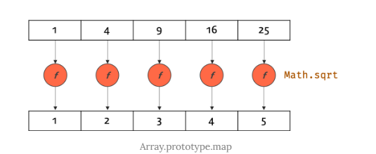

# 배열

## 27.1 배열이란?

배열은 여러 개의 값을 순차적으로 나열한 자료구조이다. 배열은 사용 빈도가 매우 높은 가장 기본적인 자료구조다.
자바스크립는 배열을 다루기 위한 유용한 메서드를 다수 제공한다. 배열은 사용 빈도가 높으므로 배열 메서드를 능숙하게 다룰 수 있다면
코딩에 매우 도움이된다.

간단한 배열을 만들어 보자. 다음 배열은 배열 리터럴을 통해 생성한 것이다. 

```javascript
const arr = ['apple', 'banana', 'orange'];
```
배열이 가지고 있는 값을 요소라고 부른다.
자바스크립트의 모든 값은 배열의 요소가 될 수 있다. 즉, 원시값은 물론 객체, 함수, 배열 등 자바스크립트에서
값으로 인정하는 모든 것으 배열의 요소가 될 수 있다.

배열의 요소는 배열에 자신의 위치를 나타내는 0 이상의 정수인 인덱스를 갖는다. 인덱스는 배열의 요소에 접근할 때
사용한다. 대부분의 프로그래밍 언어에서 인덱스는 0부터 시작한다.

요소에 접근할 때는 대괄호 표기법을 사용한다. 

배열은 요소의 개수, 즉 배열의 길이를 나타내는 length 프로퍼티를 갖는다.

배열은 인덱스와 length 프로퍼티를 갖기 때문에 for 문을 통해 순차적으로 요소에 접근할 수 있다.

자바스크립트는 배열이라는 타입은 존재하지 않는다. 배열은 객체 타입이다.

```javascript
const arr = ['apple', 'banana', 'orange'];

console.log(typeof arr); // object
```

배열은 배열 리터럴, Array 생성자 함수, Array.of , Array.from 메서드로 생성할 수 있다.
배열의 생성자 함수는 Array 이며, 배열의 프로토타입 객체는 Array.prototype 이다. 
Array.prototype 은 배열을 위한 빌트인 메서드를 제공한다.


```javascript
const arr = [1,2,3];

console.log(arr.constructor === Array); // true
console.log(Object.getPrototypeOf(arr) === Array.prototype); // true
```

배열은 객체지만 일반 객체와는 구별되는 독특한 특징이 있다.


일반 객체와 배열을 구분하는 가장 명확한 차이는 "값의 순서"와 "length 프로퍼티"다.

인덱스로 표현되는 값의 순서와 length 프로퍼티를 갖는 배열은 반복문을 통해 순차적으로 값에 접근하기 적합한 자료구조다.

배열의 장점은 처음부터 순차적으로 요소에 접근할 수도 있고, 마지막부터 역순으로 요소에 접근할 수도 있으며,
특정 위치부터 순차적으로 요소에 접근할 수도 있다는 것이다. 이는 배열이 인덱스, 즉 값의 순서와 length 프로퍼티를 갖기 때문에 가능한 것이다.


## 27.2 자바스크립트 배열은 배열이 아니다.

자료구조에서 말하는 배열은 동일한 크기의 메모리 공간이 빈틈없이 연속적으로 나열된 자료구조를 말한다.
즉, 배열의 요소는 하나의 데이터 타입으로 통일되어 있으며 서로 연속적으로 인접해 있다. 이러한 배열을 밀집 배열이라 한다.


이처럼 일반적인 의미의 배열은 각 요소가 동일한 데이터 크기를 가지며, 빈틈없이 연속적으로 이어져 있으므로
다음과 같이 인덱스를 통해 단 한 번의 연산으로 임의의 요소에 접근 할 수 있다. (임의 접근, 시간 복잡도 O(1))

이는 매우 효율적이며, 고속으로 동작한다.

`감섹 대상 요소의 메모리 주소 = 배열의 시작 메모리 주소 + 인덱스 * 요소의 바이트 수`

이처럼 배열은 인덱스를 통해 효울적으로 요소에 접근할 수 있다는 장점이 있다. 하지만 정렬되지 않은 배열에서
특정한 요소를 검색하는 경우 배열의 모든 요소를 처음부터 특정 요소를 발견할 때까지 차례대로 검색해야 한다. 

(선형 검색 , 시간 복잡도 O(n))


```javascript
function linearSearch(array , target) {
    const length = array.length;

    for(let i=0; i< length; i++) {
        if(array[i] === target) return i;
    }
    return -1;
}
console.log(linearSearch([1,2,3,4,5,6],3)); // 2
console.log(linearSearch([1,2,3,4,5,6],0)); // -1
```

또한 배열에 요소를 삽입하거나 삭제하는 경우 배열의 요소를 연속적으로 유지하기 위해 요소를 이동시켜야하는 단점도 있다.


자바스크립트의 배열은 지금까지 살펴본 자료구조에서 말하는 일반적인 의미의 배열과 다르다. 
즉, 배열의 요소를 위한 각각의 메모리 공간을 동일한 크기를 갖지 않아도 되며, 연속적으로 이어져 있지 않을 수도 있다.
배열의 요소가 연속적으로 이어져 있지 않는 배열을 희소 배열이라 한다.

이처럼 자바스크립트의 배열은 엄밀히 말해 일반적 의미의 배열이 아니다. 
자바스크립트의 배열은 일반적인 배열의 동작을 흉내 낸 특수한 객체다.

```javascript
console.log(Object.getOwnPropertyDescriptors([1,2,3]));
/*
{
    '0': { value: 1, writable: true, enumerable: true, configurable: true },
    '1': { value: 2, writable: true, enumerable: true, configurable: true },
    '2': { value: 3, writable: true, enumerable: true, configurable: true },
    length: { value: 3, writable: true, enumerable: false, configurable: false }
}
*/
```


자바스크립트의 배열은 인덱스를 나타내는 문자열을 프로퍼티 키로 가지며, length 프로퍼티를 갖는 특수한 객체다.
자바스크립트 배열의 요소는 사실 프로퍼티 값이다. 자바스크립트에서 사용할 수있는 모든 값은 객체의 프로퍼티 값이 될 수 있으므로
어떤 타입의 값이라도 배열의 요소가 될 수 있다.

````javascript
const arr = [
    'string',
    10,
    true,
    null,
    undefined,
    NaN,
    Infinity,
    [],
    {},
    function (){}
];
````

일반적인 배열과 자바스크립트 배열의 장단점을 정리해보면 다음과 같다.

- 일반적인 배열은 인덱스로 요소에 빠르게 접근할 수 있다. 하지만 요소를 삽입 또는 삭제하는 경우에는 효율적이지 않다.
- 자바스크립트 배열은 해시 테이블로 구현된 객체이므로 인덱스로 요소에 접근하는 경우 일반적인 배열보다 성능적인 면에서 느릴 수
밖에 없는 구조적인 단점이 있다. 하지만 요소를 삽입 또는 삭제하는 경우에는 일반적인 배열보다 빠른 성능을 기대할 수 있다.

  

즉 , 자바스크립트 배열은 인덱스로 배열 요소에 접근하는 경우에는 일반적인 배열보다 느리지만 요소를 삽입 또는
삭제하는 경우에는 일반적인 배열보다 빠르다. 자바스크립트 배열은 인덱스로 접근하는 경우의 성능 대비 배열 요소를
삽입 또는 삭제하는 경우의 성능을 선택한 것이다.

인덱스로 배열 요소에 접근할 때 일반적이 배열보다 느릴 수 밖에 없는 구조적인 단점을 보완하기 위해
대부분의 모던 자바스크립트 엔진은 배열을 일반 객체와 구별하여 좀 더 배열처럼 동작하도록 최적화하야 구현했다.
다음과 같이 배열과 일반 객체의 성능을 테스트해 보면 배열이 일반 객체보다 약 2배 정도 빠르다는 것을 알수 있다.

```javascript
const arr = [];

console.time('Array Performance Test');

for(let i=0; i < 10000000; i++){
    arr[i] = i;
}

console.timeEnd('Array Performance Test');
// 278.133ms


const obj = {};

console.time('Object Performance Test');

for(let i=0; i<10000000; i++) {
    obj[i] = i;
}

console.timeEnd('Object Performance Test');
// 416.836 ms
```

배열이 일반 객체보다 약 2배 정도 빠르다.


## 27.3 length 프로퍼티와 희소 배열

length 프로퍼티는 요소의 개수, 즉 배열의 길이를 나타내는 0 이상의 정수를 값으로 갖는다. 
length 프로퍼티의 값은 빈 배열일 경우 0이며, 빈 배열이 아닌 경우 가장 큰 인덱스에 1을 더한 것과 같다.

length 프로퍼티의 값은 배열에 요소를 추가하거나 삭제하면 자동 갱신된다.

```javascript
const arr = [1,2,3];
console.log(arr.length); // 3

// 요소 추가
arr.push(4);
// 요소를 추가하면 length 프로퍼티의 값이 자동 갱신된다.
console.log(arr.length); // 4

// 요소 삭제
arr.pop();
// 요소를 삭제하면 length 프로퍼티의 값이 자동 갱신된다.
console.log(arr.length);
```

length 프로퍼티 값은 요소의 개수, 즉 배열의 길이를 바탕으로 결정되지만 임으의 숫자 값을 명시적으로 할당할 수도 있다.

현재 length 프로퍼티 값보다 작은 숫자 값을 할당하면 배열의 길이가 줄어든다.

```javascript
const arr = [1,2,3,4,5];

// 현재 length 프로퍼티 값인 5보다 작은 숫자 값 3을 length 프로퍼티에 할당
arr.length = 3;

// 배열의 길이가 5에서 3으로 줄어든다.
console.log(arr); // [ 1, 2, 3 ]


```

주의할 것은 현재 length 프로퍼티 값보다 큰 숫자 값을 할당하는 경우다. 이때 length 프로퍼티 값은 변경되지만
실제로 배열의 길이가 늘어나지는 않는다.

```javascript
const arr = [1];

// 현재 length 프로퍼티 값인 1보다 큰 숫자 값 3을 length 프로퍼티에 할당
arr.length = 3;

// length 프로퍼티 값은 변경되지만 실제로 배열의 길이가 늘어나지는 않는다.
console.log(arr.length); // 3
console.log(arr); // [ 1, <2 empty items> ]
```

위 예제에서 arr[1] 과  arr[2]에는 값이 존재하지 않는다.

이처럼 현재 length 프로퍼티 값보다 큰 숫자 값을 length 프로퍼티에 할당하는 경우 length 프로퍼티 값은 성공적으로
변경되지만 실제 배열에는 아무런 변함이 없다. 값 없이 비어 있는 요소를 위해 메모리 공간을 확보하지 않으며 빈 요소를 생성하지도 않는다.

```javascript
const arr = [1];

// 현재 length 프로퍼티 값인 1보다 큰 숫자 값 3을 length 프로퍼티에 할당
arr.length = 3;

console.log(Object.getOwnPropertyDescriptors(arr));
/*
{
  '0': { value: 1, writable: true, enumerable: true, configurable: true },
  length: { value: 3, writable: true, enumerable: false, configurable: false }
}

* */
```

이처럼 배열의 요소가 연속적으로 위치하지 않고 일부가 비어 있는 배열을 희소 배열이라 한다.
자바스크립트는 희소 배열을 문법적으로 허용한다.
위 예제는 배열의 뒷부부만 비어 있어서 요소가 연속적으로 위치하는 것처럼 보일 수 있으나 중간이나 앞부분이 비어 있을 수도 있다.


```javascript
// 희소 배열
const sparse = [,2,,4];

// 희소 배열의 length 프로퍼티 값은 요소의 개수와 일치하지 않는다.
console.log(sparse.length); // 4
console.log(sparse); // [ <1 empty item>, 2, <1 empty item>, 4 ]

// 배열 sparse 에는 인덱스가 0, 2 인 요소가 존재하지 않는다.
console.log(Object.getOwnPropertyDescriptors(sparse));
/*
{
    '1': { value: 2, writable: true, enumerable: true, configurable: true },
    '3': { value: 4, writable: true, enumerable: true, configurable: true },
    length: { value: 4, writable: true, enumerable: false, configurable: false }
}
*/


```

일반적인 배열의 length 는 배열 요소의 개수, 즉 배열의 길이와 언제나 일치한다.
하지만 희소 배열은 length 와 배열 요소의 개수가 일치하지 않는다.
희소 배열의 length 는 희소 배열의 실제 요소 개수보다 언제나 크다.

자바스크립트는 문법적으로 희소 배열을 허용하지만 희소 배열은 사용하지 않는 것이 좋다.
의도적으로 희소 배열을 만들어야 하는 상황은 발생하지 않는다. 희소 배열은 연속적인 값의 집합이라는 배열의 기본적인 개념과 맞지 않으며
성능에도 좋지 않은 영향을 준다. 최적화가 잘 되어 있는 모던 자바스크립트 엔진은 요소의 타입이 일치하는 배열을 생성할 때 일반적인
의미의 배열처럼 연속된 메모리 공간을 확보하는 것으로 알려져 있다.

배열을 생셩할 경우에는 희소 배열을 생성하지 않도록 주의하자. 배열에는 같은 타입의 요소를 연속적으로 위치시키는 것이 최선이다. 

## 27.4 배열 생성

### 27.4.1 배열 리터럴

배열 리터럴은 0개 이상의 요소를 쉼표로 구분하여 대괄호([])로 묶는다. 


### 27.4.2 Array 생성자 함수

Array 생성자 함수를 통해 배열을 생성할 수도 있다.

### 27.4.3 Array.of

ES6에서 도입된 Array.of 메서드는 전달된 인수를 요소로 갖는 배열을 생성한다.

```javascript
Array.of(1); // [1]

Array.of(1,2,3,); // [1,2,3]

Array.of('string'); // ['string']
```

### 27.4.4 Array.from

ES6에서 도입된 Array.from 메서드는 유사 배열 객체 또는 이터러블 객체를 인수로 전달받아 
배열로 변환하여 반환한다. 

## 27.7 배열 요소의 삭제

배열은 사실 객체이기 때문에 배열의 특정 요소를 삭제하기 위해 delete 연산자를 사용할 수 있다.

```javascript
const arr = [1,2,3];

// 배열 요소의 삭제
delete arr[1];
console.log(arr); // [1 , empty , 3]

// length 프로퍼티에 영향을 주지 않는다. 즉, 희소 배열이 된다.
console.log(arr.length); // 3
```

delete 연산자는 객체의 프로포티를 삭제한다. 따라서 위 예제의 delete arr[1]은 arr에서 프로퍼티 키가
'1'인 프로퍼티를 삭제한다. 이때 배열은 희소 배열이 되며 length 프로퍼티 값은 변하지 않는다. 
따라서 희소 배열을 만드는 delete 연산자는 사용하지 않는 것이 좋다.

희소 배열을 만들지 않으면서 배열의 특정 요소를 완전히 삭제하려면 Array.prototype.splice 메서드를 사용한다.

```javascript
const arr = [1,2,3];

// arr[1]  부터 1개의 요소를 제거
arr.splice(1,1);
console.log(arr);

// length 프로퍼티가 자동 갱신된다.
console.log(arr.length); // 2
```


### 27.8 배열 메서드

자바스크립트는 배열을 다룰 때 유용한 다양한 빌트인 메서드를 제공한다. 
Array 생성자 함수는 정적 메서드를 제공하며, 배열 객체의 프로토타입인 Array.prototype 은 프로토타입 메서드를 제공한다.

배열 메서드는 결과물을 반환하는 패턴이 두 가지이므로 주의가 필요하다. 배열에는 원본 배열(배열 메서드를 호출한 배열 ,
즉 배열 메서드의 구현체 내부에서 this가 가리키는 객체)을 직접 변경하는 메서드 <sup>mutator method</sup>
와 원본 배열을 직접 변경하지 않고 새로운 배열을 생성하여 반환하는 메서드 <sup>accessor method</sup>가 있다.

```javascript
const arr = [1];

// push 메서드는 원본 배열으 직접 변경한다.
arr.push(2);
console.log(arr); // [1,2]
```

```javascript
const arr = [1];

// push 메서드는 원본 배열으 직접 변경한다.
arr.push(2);
console.log(arr); // [1,2]


// concat 메서드는 원본 배열을 직접 변경하지 않고 새로운 배열을 생성하여 반환한다.
const result = arr.concat(3);
console.log(arr); // [1,2]
console.log(result); // [1,2,3]
```

ES5부터 도입된 배열 메서드는 대부분 원본 배열을 직접 변경하지 않지만 초창기 배열 메서드는
원본 배열을 직접 변경하는 경우가 많다. 원본 배열을 직접 변경하는 
메서드는 외부 상태를 직접 변경하는 부수 효과가 있으므로 사용할 때 주의해야 한다.


### 27.8.1 Array.isArray

Array.isArray 메서드는 전달된 인수가 배열이면 true, 배열이 아니면 false를 반환한다.

### 27.8.2 Array.prototype.indexOf

indexOf 메서드는 원본 배열에서 인수로 전달된 요소를 검색하여 인덱스를 반환한다.

- 원본 배열에 인수로 전달한 요소의 중복되는 요소가 여러 개 있다면 첫 번째로 검색된 요소의 인덱스를 반환한다.
- 원본 배열에 인수로 전달된 요소가 존재하지 않으면 -1을 반환한다.

```javascript
const arr = [1,2,2,3];

// 배열 arr에서 요소 2를 검색하여 첫 번째로 검색된 요소의 인덱스를 반환한다.
console.log(arr.indexOf(2)); // 1

// 배열 arr에 요소 4가 없으므로 -1을 반환한다.
console.log(arr.indexOf(4)); // -1

// 두 번째 인수는 검색을 시작할 인덱스다. 두 번째 인수를 생략하면 처음부터 검색한다.
console.log(arr.indexOf(2,2)); // 2
```

indexOf 메서드 대신 Es7에서 도입된 Array.prototype.includes 메서드를 사용하면 가독성이 더 좋다.

```javascript
const foods = ['apple','banana','orange'];

if(!foods.indexOf('orange')){
    foods.push('orange');
}

console.log(foods);
```


### 27.8.3 Array.prototype.push

push 메서드는 인수로 전달받은 모든 값을 원본 배열의 마지막 요소로 추가하고 변경된 length 프로퍼티 값을
반환한다. 


```javascript
const arr = [1,2];

// 인수로 전달받은 모든 값을 원본 배열 arr의 마지막 요소로 추가하고 변경된 length 값을 반환한다.
let result = arr.push(3,4);

console.log(result); // 4

// push 메서드는 원본 배열을 직접 변경한다.

console.log(arr); // [1,2,3,4]
```

push 메서드는 성능 면에서 좋지 않다. 마지막 요소로 추가할 요소가 하나 뿐이라면
push 메서드를 사용하지 않고 length 프로퍼티를 사용하여 배열의 마지막에 요소를
직접 추가할 수 도 있다. 이 방법이 push 메서드보다 빠르다.

```javascript
const arr = [1,2];

// arr.push(3)과 동일한 처리를 한다. 이 방법이 push 메서드보다 빠르다.
arr[arr.length] = 3;
console.log(arr); // [1,2,3] 
```

push 메서드는 원본 배열을 직접 변경하는 부수 효과가 있다. 따라서 push 메서드보다는 ES6의 스프레드
문법을 사용하는 편이 좋다. 스프레드 문법을 사용하면 함수 호출 없이 표현식으로 마지막에 요소를 추가할 수 있으며
부수 효과도 좋다. 


```javascript
const arr = [1,2];

// ES6 스프레드 문법
const newArr = [...arr ,3];

console.log(newArr); // [1,2,3]
```

### 27.8.4 Array.prototype.pop

pop 메서드와 push 메서드를 사용하면 스택을 쉽게 구현할 수 있다.

스택을 생성자 함수로 구현해보면 다음과 같다.

```javascript
const Stack = (function () {
    function Stack(array = []){
        if(!Array.isArray(array)){
            throw new TypeError(`${array} is not an array.`);
        }
        this.array = array;
    }
    Stack.prototype = {
        constructor : Stack,

        push(value){
          return this.array.push(value);
        },
        pop(){
            return this.array.pop();
        },
        entries() {
            return [...this.array];
        }
    };
    return Stack;
}());

const stack = new Stack([1,2]);
console.log(stack.entries()); // [1,2];

stack.push(3);
console.log(stack.entries()); //[1,2,3];

stack.pop();
console.log(stack.entries()); // [1,2]
```


### 27.8.5 Array.prototype.unshift

unshift 메서드는 인수로 전달받은 모든 값을 원본 배열의 선두에 요소로 추가하고 변경된 length 프로퍼티 값을
반환한다. unshift 메서드는 원본 배열으 직접 변경한다.

```javascript
const arr = [1,2];

// 인수로 전달받은 모든 값을 원본 배열의 선두에 요소로 추가하고 변경된 length 값을 반환한다.
let result = arr.unshift(3,4);
console.log(result); // 4

// unshift 메서드는 원본 배열을 직접 변경한다.
console.log(arr); // [3,4,1,2]
```

unshift 메서드는 원본 배열을 직접 변경하는 부수 효과가 있다.
따라서 unshift 메서드보다는 ES6의 스프레드 문법을 사용하는 편이 좋다. 


```javascript
const arr = [1,2];

// ES6 스프레드 문법
const newArr = [3, ...arr];
console.log(newArr); // [3,1,2]

```

### 27.8.6 Array.prototype.shift

shift 메서드는 원본 배열에서 첫 번째 요소를 제거하고 제거한 요소를 반환한다.
원본 배열이 빈 배열이면 undefined 를 반환한다. shift 메서드는 원본 배열을 직접 변경한다.

```javascript
const arr = [1,2];

// 원본 배열에서 첫 번째 요소를 제거하고 제거한 요소를 반환한다.
let result = arr.shift();
console.log(result); // 1

console.log(arr); // [2]
```

shift 메서드와 push 메서드를 사용하면 큐를 쉽게 구현할 수 있다.

### 27.8.7 Array.prototype.concat

concat 메서드는 인수로 전달된 값들을 원본 배열의 마지막 요소로 추가한 후 새로운 배열을 반환한다. 

인수로 전달한 값이 배열인 경우 배열을 해체하여 새로운 배열의 요소로 추가한다. 원본 배열은 
변경되지 않는다.

```javascript
const arr1 = [1,2];
const arr2 = [3,4];

let result = arr1.concat(arr2);

console.log(result); // [1,2,3,4]

result = arr1.concat(3);
console.log(result); // [1,2,3]

result = arr1.concat(arr2,5);
console.log(result); // [1,2,3,4,5]

console.log(arr1); // [1,2]
```

push 와 unshift 메서드는 concat 메서드로 대체할 수 있다.  push 와 unshift 메서드는 concat 메서드와
유사하게 동작하지만 다음과 같은 미묘한 차이가 있다.

- push 와 unshift 메서드는 원본 배열을 직접 변경하지만  concat 메서드는 원본 배열을 변경하지 않고 새로운 배열을 반환한다.
따라서 push 와 unshift 메서드를 사용할 경우 원본 배열을 반드시 변수에 저장해 두어야 하며 concat 메서드를 사용할 경우
반환값을 반드시 변수에 할당받아야 한다. 

```javascript
const arr1 = [3,4];

// unshift 메서드는 원본 배열을 직접 변경한다.
// 따라서 원본 배열을 변수에 저장해 두지 않으면 변경된 배열을 사용할 수 없다.
arr1.unshift(1,2);

console.log(arr1); // [1,2,3,4]

//push 메서드는 원본 배열을 직접 변경한다.
// 따라서 원본 배열을 변수에 저장해 두지 않으면 변경된 배열을 사용할 수 없다.
arr1.push(5,6);
// push 메서드를 사용할 경우 원본 배열을 반드시 변수에 저장해 두어야 결과를 확인할 수 있다.
console.log(arr1); //  [1,2,3,4,5,6]


// unshift 와 push 메서드는 concat 메서드로 대체할 수 있다.
const arr2 = [3,4];

// concat 메서드는 원본 배열을 변경하지 않고 새로운 배열을 반환한다.
// arr1.unshift(1,2)를 다음과 같이 대체할 수 있다.
let result = [1,2].concat(arr2);

console.log(result) // [1,2,3,4]
```

concat 메서드는 ES6의 스프레드 문법으로 대체할 수 있다.

```javascript
let result = [1,2].concat([3,4]);

console.log(result);

// concat 메서드는 ES6의 스프레드 문법으로 대체할 수 있다.
result = [...[1,2], ...[3,4]];
console.log(result); // [1,2,3,4]
```

### 27.8.8 Array.prototype.splice

push , pop, unshift , shift 메서드는 모두 원본 배열을 직접 변경하는 메서드이며
원본 배열의 처음이나 마지막에 요소를 추가하거나 제거한다.


원본 배열의 중간에 요소를 추가하거나 중간에 있는 요소를 제거하는 경우 splice 메서드를 사용한다.
splice 메서드는 3개의 매개변수가 있으며 원본 배열을 직접 변경한다.


```javascript
const arr = [1,2,3,4];

// 원본 배열의 인덱스 1부터 2개의 요소를 제거하고 그 자리에 새로운 요소 20,30 을 삽입한다.
const result = arr.splice(1,2,20,30);

// 제거한 요소가 배열로 반환된다.
console.log(result); // [2,3]

// splice 메서드는 원본 배열을 직접 변경한다.
console.log(arr); // [1,20,30,4]
```

### 27.8.9 Array.prototype.slice

slice 메서드는 인수로 전달된 범위의 요소들을 복사하여 배열로 반환한다. 
원본 배열은 변경되지 않는다.
이름이 유사한 splice 메서드는 원본 배열을 변경한다.

### 27.8.10 Array.prototype.join

join 메서드는 원본 배열의 모든 요소를 문자열로 변환한 후 , 인수로 전달받은 문자열, 즉 구분자로 연결한 문자열을
반환한다. 
구분자는 생략 가능하며 기본 구분자는 콤바(',')다.

```javascript
const arr = [1,2,3,4];

// 기본 구분자는 콤마다.
// 원본 배열 arr의 모든 요소를 문자열로 변환한 후 기본 구분자로 연결한 문자열을 반환한다.
console.log(arr.join()); // 1,2,3,4;

console.log(arr.join('')); // 1234

console.log(arr.join(':')); // 1:2:3:4
```

### 27.8.11 Array.prototype.reverse

reverse 메서드는 원본 배열의 순서를 반대로 뒤집는다. 
이때 원본 배열이 변경된다. 반환값은 변경된 배열이다.

```javascript
const arr = [1,2,3];
const result = arr.reverse();


// reverse 메서드는 원본 배열을 직접 변경한다.
console.log(arr); // [3,2,1]

// 반환값은 변경된 배열이다.
console.log(result); //[3,2,1]
```

### 27.8.12 Array.prototype.fill

ES6에서 도입된 fill 메서드는 인수로 전달받은 값을 배열의 처음부터 끝까지 요소로 채운다.
이때 원본 배열이 변경된다. 

```javascript
const arr = [1,2,3];

// 인수로 전달받은 값 0을 배열의 처음 부터 끝까지 요소로 채운다.
arr.fill(0);

// fill 메서드는 원본 배열을 직접 변경한다/
console.log(arr); // [0,0,0]
```

두 번째 인수로 요소 채우기를 시작할 인덱스를 전달할 수 있다.

```javascript
const arr = [10,11,12];

// 인수로 전달 받은 값 2를  배열의 인덱스 1부터 끝까지 요소로 채운다.

arr.fill(2,1);

console.log(arr); // [10,2,2]
```

### 27.8.13 Array.prototype.includes

ES7 에서 도입된 includes 메서드는 배열 내에 특정 요소가 포함되어 있는지 확인하여 true 또는 false 를 반환한다.

### 27.8.14 Array.prototype.flat

ES10(ECMAScript 2019)에서 도입된 flat 메서드는 인수로 전달한 깊이 만큼 재귀적으로  배열을 평탄화한다.

```javascript
const res = [1,[2,3,4,5]].flat();
console.log(res); // [ 1, 2, 3, 4, 5 ]
```

중첩 배열을 평탄화할 깊이를 인수로 전달할 수 있다. 인수를 생략할 경우 기본값은 1이다.
인수로 Infinity를 전달하면 중첩 배열 모두를 평탄화한다.

## 27.9 배열 고차 함수

고차 함수는 함수를 인수로 전달받거나 함수를 반환하는 함수를 말한다. 
자바스크립트의 함수는 일급 객체이므로 함수를 값처럼 인수로 전달할 수 있으며 반환할 수도 있다.
고차 함수는 외부 상태의 변경이나 가변데이터를 피하고 불변성을 지향하는 함수형 프로그래밍에 기반을 두고 있다.

함수형 프로그래밍은 순수 함수와 보조 함수의 조합을 통해 로직 내에 존재하는 조건문과 반복문을 제거하여
복잡성을 해결하고 변수의 사용을 억제하여 상태 변경을 피하려는 프로그래밍 패러다임이다. 

조건문이나 반복문은 로직의 흐름을 이해하기 어렵게 하여 가독성을 해치고, 변수는 누군가에 의해
언제든지 변경될 수 있어 오류 발생의 근본적 원인이 될 수 있기 때문이다. 
함수형 프로그래밍은 결국  순수 함수를 통해 부수 효과를 최대한 억제하여 오류를 피하고 프로그램의
안정성을 높이려는 노력의 일환이라고 할 수 있다.

### 27.9.1 Array.prototype.sort

sort 메서드는 배열의 요소를 정렬한다. 
원본 배열을 직접 변경하며 정렬된 배열을 반환한다.

sort 메서드는 기본적으로 오름차순으로 요소를 정렬한다. 

```javascript
const fruits = ['Banana' ,'Orange' , 'Apple'];

fruits.sort();

console.log(fruits); // [ 'Apple', 'Banana', 'Orange' ]

```

sort 메서드는 기본적으로 오름차순으로 요소를 정렬한다. 따라서 내림차순으로 요소를 정렬하려면
sort 메서드를 사용하여 오름차순으로 정렬한 후 reverse 메서드를 사용하여 요소의 순서를 뒤집는다.

문자열 요소로 이루어진 배열의 정렬은 아무런 문제가 없다. 하지만 숫자 요소로 이루어진 배열을 정렬할 때는
주의가 필요하다.

```javascript
const points = [40,100,1,5,2,25,10];

points.sort();

// 숫자 요소들로 이루어진 배열은 의도한 대로 정렬되지 않는다.
console.log(points); // [1, 10, 100, 2, 25, 40,  5]

```

sort 메서드의 기본 정렬 순서는 유니코드 코드 포인트의 순서를 따른다. 배열의 요소가 숫자 타입이라 할지라도
배열의 요소를 일시적으로 문자열로 변환한 후 유니코드 코드 포인트의 순서를 기준으로 정렬한다. 


숫자 요소를 정렬할 때는 sort 메서드에 정렬 순서를 정의하는 비교 함수를 인수로 전달해야 한다.

```javascript
const points = [40,100,1,5,2,25,10];

points.sort((a,b) => a-b);

console.log(points); //[1, 2, 5, 10, 25, 40, 100]

console.log(points[0], points[points.length-1]); // 1 100

points.sort((a,b) => b-a);
console.log(points); //[100, 40, 25, 10, 5,  2,  1]
```

객체를 요소로 갖는 배열 정렬 

```javascript
const todos = [
    {id : 4 , content : 'Javascript'},
    {id : 1 , content : 'HTML'},
    {id : 2 , content : 'CSS'},
]

function compare(key) {
    return (a,b) => (a[key] > b[key] ? 1 : (a[key] < b[key] ? -1 : 0));
}


todos.sort(compare('id'));

console.log(todos);

todos.sort(compare('content'));
console.log(todos);
```


### 27.9.2 Array.prototype.forEach

함수형 프로그래밍은 순수 함수와 보조 함수의 조합을 통해 로직 내에 존재하는 조건문과 반복문을 제거하여
복잡성을 해결하고 변수의 사용을 억제하여 상태 변경을 피하려는 프로그래밍 패러다임이다.

조건문과 반복문은 로직의 흐름을 이해하기 어렵게 한다. 

특히 for문 반복을 위한 변수를 선언해야 하며, 조건식과 증감식으로 이루어져 있어서
함수형 프로그래밍이 추구하는 바와 맞지 않다.


forEach 메서드는 for 문을 대체할 수 있는 고차 함수다.
forEach 메서는 자신의 내부에서 반복문을 실행한다. 즉 , forEach 메서드는 반복문을 추상화한 고차 함수로서 
내부에서 반복문을 통해 자신을 호출한 배열을 순회하면서 수행해야 할 처리를 콜백 함수로 전달받아 반복 호출한다.

```javascript
const numbers = [1,2,3];
const pows = [];

numbers.forEach(item => pows.push(item**2));
console.log(pows); // [ 1, 4, 9 ]
```

forEach 메서드의 콜백 함수는 forEach 메서드를 호출한 배열의 요소값과 인덱스, forEach 메서드를 호출한
배열 자체, 즉 this 를 순차적으로 전달 받을 수 있다. 다시 말해, forEach 메서드는 콜백 함수를 호출할 때
3개의 인수, 즉 forEach 메서드를 호출한 배열의 요소값과 인덱스, forEach 메서드를 호출한 배열(this)를 순차적으로
전달한다. 

```javascript
[1, 2, 3].forEach((item, index, arr) => {
    console.log(`요소 값 : ${item} , 인덱스 : ${index} , this : ${JSON.stringify(arr)}`);
})

/*
요소 값 : 1 , 인덱스 : 0 , this : [1,2,3]
요소 값 : 2 , 인덱스 : 1 , this : [1,2,3]
요소 값 : 3 , 인덱스 : 2 , this : [1,2,3]
* */
```

forEach 메서드는 원본 배열을 변경하지 않는다. 하지만 콜백 함수를 통해 원본 배열을 변경할 수는 있다.


```javascript
const numbers =[1,2,3];


// forEach 메서드는 원본 배열을 변경하지 않지만 콜백 함수를 통해 원본 배열을 변경할  수는 있다.
// 콜백 함수의 세 번째 매개변수  arr는 원본 배열 numbers를 가리킨다.
// 따라서 콜백 함수의 세 번째 매개변수 arr를 직접 변경하면 원본 배열 numbers 가 변경된다.
numbers.forEach((item , index, arr) =>{
    arr[index] = item**2;
})

console.log(numbers); // [ 1, 4, 9 ]

```

forEach 메서드는 for 문에 비해 성능이 좋지 않지만 가독성이 더 좋다. 따라서 요소가 대단히 많은 배열을 순회하거나
시간이 많이 걸리는 복잡한 코드 또는 높은 성능이 필요한 경우가 아니라면 for 문 대신 forEach 메서드를 사용할 것을 권장한다.


### 27.9.3 Array.prototype.map

map 메서드는 자신을 호출한 배열의 모든 요소를 순회하면서 인수로 전달받은 콜백 함수를 반복 호출한다. 
그리고 콜백 함수의 반환값들로 구성된 새로운 배열을 반환한다.
이때 원본 배열은 변경되지 않는다.

```javascript
const numbers = [1,4,9];

// map 메서드는 numbers 배열의 모든 요소를 순회하면서 콜백 함수를 반복 호출한다.
// 그리고 콜백 함수의 반환값들로 구성된 새로운 배열을 반환한다.

const roots = numbers.map(item => Math.sqrt(item));

// map 메서드는 새로운 배열을 반환한다.
console.log(roots); // [ 1, 2, 3 ]
// map 메서드는 원본 배열을 변경하지 않는다.
console.log(numbers); // [ 1, 4, 9 ]
```

forEach 메서드와 map 메서드의 공통점은 자신을 호출한 배열의 모든 요소를 순회하면서 인수로
전달받은 콜백 함수를 반복 호출한다는 것이다. 

하지만 forEach 메서드는 언제나 undefined를 반환하고, map 메서드는 콜백 함수의 반환값들로 구성된
새로운 배열을 반환하는 차이가 있다. 즉, forEach 메서드는 단순히 반복문을 대체하기 위한 고차함수이고, 
map 메서드는 요소값을 다른 값으로 매핑 한 새로운 배열을 생성하기 위한 고차 함수다

map 메서드가 생성하여 반환하는 새로운 배열의 length 프로퍼티 값은 map 메서드를 호출한 배열의 length 
프로퍼티 값과 반드시 일치한다. 즉, map 메서드를 호출한 배열과 map 메서드가 생성하여 반환한 배열은 1:1 매핑한다.



forEach 메서드와 마찬가지로 map 메서드의 콜백 함수는 map 메서드를 호출한 배열의 요소값과 인덱스 , map 메서드를 호출한
배열 자체, 즉 this를 순차적으로 전달받을 수 있다. 다시 말해, map 메서드는 콜백 함수를 호출할 때
3개의 인수, 즉 map 메서드를 호출한 배열의 요소값과 인덱스 그리고 map 메서드를 호출한 배열(this)를 순차적으로 전달한다.


### 27.9.4 Array.prototype.filter

filter 메서드는 자신을 호출한 배열의 모든 요소를 순회하면서 인수로 전달받은 콜백 함수를 반복 호출한다 .
그리고 콜백 함수의 반환값이 true인 요소로만 구성된 새로운 배열을 반환한다. 

```javascript
const number = [1,2,3,4,5];

const odds = number.filter(item => item%2);
console.log(odds); // [ 1, 3, 5 ]
```

filter 메서드를 사용해 특정 요소를 제거할 경우 특정 요소가 중복되어 있으면 중복된 요소가 모두 제거된다.
특정 요소를 하나만 제거하려면 indexOf 메서드를 통해 특정 요소의 인덱스를 취득한 다음 splice 메서드를 사용한다.


### 27.9.5 Array.prototype.reduce

reduce 메서드는 자신을 호출한 배열의 모든 요소를 순회하며 인수로 전달받은 콜백 함수를 반복 호출한다.
그리고 콜백 함수의 반환값을 다음 순회 시에 콜백 함수의 첫 번째 인수로 전달하면서 콜백 함수를 호출하여 
하나의 결과값을 만들어 반환한다. 이때 원본 배열은 변경되지 않는다. 

reduce 메서드는 첫 번째 인수로 콜백 함수, 두 번째 인수로 초기값을 전달받는다.
reduce 메서드의 콜백 함수에는 4개의 인수, 초기값 또는 콜백 함수의 이전 반환값, reduce 메서드를 호출한
배열의 요소값과 인덱스, reduce 메서드를 호출한 배열 자체, 즉 this가 전달된다.

다음 예제를 살펴보자. 예제의 reduce 메서드는 2개의 인수, 즉 콜백 함수와 초기값 0을 전달받아 자신을 호출한 배열의 모든 요소를 누적한 결과를
반환한다.


```javascript
// 1부터 4까지 누적을 구한다.
const sum = [1,2,3,4].
reduce((accumulator, currentValue , index , array)  
    => accumulator+currentValue,0);

console.log(sum);
```


```javascript
[0, 1, 2, 3, 4].reduce(function(accumulator, currentValue, currentIndex, array) {
  return accumulator + currentValue;
});


// 화살표 함수로 만들 경우
[0, 1, 2, 3, 4].reduce( (prev, curr) => prev + curr );
```


이처럼 reduce 메서드는 초기값과 배열의 첫 번째 요소 값을 콜백 함수에게 인수로 전달하면서 호출하고 다음 순회에는
콜백 함수의 반환값과 두 번째 요소값을 콜백 함수의 인자로 전달하면서 호출한다.
이러한 과정을 반복하여 reduce 메서드는 하나의 결과값을 반환한다.

reduce 메서드는 자신을 호출한 배열의 모든 요소를 순화하며 하나의 결과값을 구해야 하는 경우에 사용한다.

**평균 구하기**

```javascript
const values = [1,2,3,4,5,6];

const average = values.reduce((acc,cur,i , {length}) => {
    return i === length-1 ? (acc+cur)/length : acc+cur;
})

console.log(average);
```

**최대값 구하기**

```javascript
const values = [1,2,3,4,5];

const max = values.reduce((acc,cur)=> (acc > cur ? acc : cur) ,0);

console.log(max);
```

**요소의 중복 횟수 구하기**

```javascript
const fruits = ['banana', 'apple' , 'orange' , 'orange' ,'apple'];

const count = fruits.reduce((acc,cur)=>{
    acc[cur] = (acc[cur] || 0 )+1;
    return acc;
},{});

console.log(count); // { banana: 1, apple: 2, orange: 2 }
```

**중복 요소 제거**

```javascript
const values = [1, 2, 1, 3, 5, 4, 5, 3, 4, 4];

const result = values.reduce(
    (unique, val, i, _values) =>
        _values.indexOf(val) === i ? [...unique, val] : unique, []
);
console.log(result); // [ 1, 2, 3, 5, 4 ]
```

### 27.9.6 Array.prototype.some 

some 메서드는 자신을 호출한 배열의 요소를 순회하면서 인수로 전달된 콜백 함수를 호출한다.
이때 some 메서드는 콜백 함수의 반환값이 단 한 번이라도 참이면 true, 모두 거짓이면 false 를 반환한다. 
즉, 배열의 요소 중에 콜백 함수를 통해 정의한 조건을 만족하는 요소가 1개 이상 존재하는지 확인하여 
그 결과를 불리언 타입으로 변환한다. 단, some 메서드를 호출한 배열이 빈 배열인 경우 언제나 false 를 반환하므로
주의해야 한다.

forEach , map , filter 메서드와 마찬가지로 some 메서드의 콜백 함수는 some 메서드를 호출한 요소값과 인덱스,
some 메서드를 호출한 배열 자체, 즉 this를 순차적으로 전달받을 수 있다.

```javascript
// 배열의 요소 중 10보다 큰 요소가 1개 이상 존재하는 지 확인
[5,10,15].some(item => item > 10) // true

[5,10,15].some(item => item < 0) // false

// 배열의 요소 중 'banana'가 1개 이상 존재하는 지 확인
['apple','banana','mango'].some(item => item === 'banana'); // true

// some 메서드를 호출한 배열이 빈 배열인 경우 언제나 false 를 반환한다.
[].some(item => item > 3) ; // false
```

### 27.9.7 Array.prototype.every

every 메서드는 자신을 호출한 배열의 요소를 순회하면서 인수로 전달된 콜백 함수를 호출한다.
이때 every 메서드는 콜백 함수의 반환값이 모두 참이면 true , 단 한 번이라도 거짓이면 false 를 반환한다. 
즉, 배열의 모든 요소가 콜백 함수를 통해 정의한 조건을 모두 만족하는지 확인하여 그 결과를 불리언 타입으로 반환한다.

단, every 메서드를 호출한 배열이 빈 배열인 경우 언제나 true를 반환하므로 주의해야 한다. 

```javascript
[5,10,15].every(item => item>3); // true

[5,10,15].every(item => item>10); // false

// every 메서드를 호출한 배열이 빈 배열인 경우 언제나 true를 반환한다.
[].every(item => item > 3); // true
```

### 27.9.8 Array.prototype.find

ES6에서 도입된 find 메서드는 자신을 호출한 배열의 요소를 순회하면서 인수로 전달된 콜백 함수를 호출하여 반환값이
true 인 첫 번째 요소를 반환한다. 
콜백 함수의 반환값이 true 인 요소가 존재하지 않는다면 undefined 를 반환한다. 

forEach , map , filter 메서드와 마찬가지로 find 메서드의 콜백 함수는 find 메서를  호출한 요소값과 인덱스, find
메서드를 호출한 배열 자체, 즉 this를 순차적으로 전달 받을 수 있다.

```javascript
const users = [
    {id : 1 , name : 'Lee'},
    {id : 2 , name : 'Kim'},
    {id : 2 , name : 'Choi'},
    {id : 3 , name : 'Park'},
];

console.log(users.find(user => user.id === 2)); // { id: 2, name: 'Kim' }
```

filter 메서드는 콜백 함수의 호출 결과가 true 인 요소만 추출한 새로운 배열을 반환한다.
따라서 filter 메서드의 반환값은 언제나 배열이다. 하지만 find 메서드는 콜백 함수의 반환값이 true 인 첫 번째 요소를
반환하므로 find 의 결과값은 배열이 아닌 해당 요소 값이다.

```javascript

console.log([1,2,2,3].filter(item => item === 2)); // [ 2, 2 ]

console.log([1,2,2,3].find(item => item ===2)); // 2
```

### 27.9.9 Array.prototype.findIndex

ES6 에서 도입된 findIndex 메서드는 자신을 호출한 배열의 요소를 순회하면서 인수로 전달된 콜백 함수를 호출하여
반환값이 true 인 첫 번째 요소의 인덱스를 반환한다. 콜백 함수의 반환값이 true 인 요소가 존재하지 않는다면
-1를 반환한다. 


```javascript
const users = [
    {id : 1, name : 'Lee'},
    {id : 2, name : 'Kim'},
    {id : 2, name : 'Choi'},
    {id : 3, name : 'Park'},
]

console.log(users.findIndex(user => user.id === 2)); // 1


console.log(users.findIndex(user => user.name === 'Park'));  // 3
```


### 27.9.10 Array.prototype.flatMap

ES10 에서 도입된 flatMap 메서드는 map 메서드를 통해 생성된 새로운 배열을 평탄화한다.

즉, map 메서드와 flat 메서드를 순차적으로 실행하는 효과가 있다. 