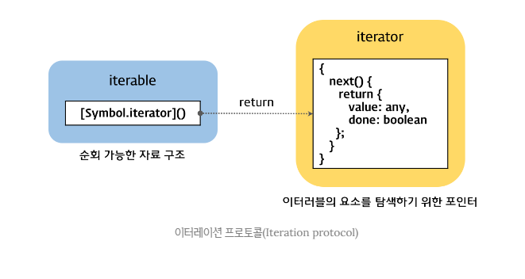

# 이터러블 


## 34.1 이터레이션 프로토콜

ES6에서 도입된 이터레이션 프로토콜은 순회 가능한 데이터 컬렉션을 만들귀 위해
ECMAScript 사양에 정의하여 미리 약속한 규칙이다. 

ES6 이전의 순회 가능한 데이터 컬렉션, 즉 배열, 문자열, 유사 배열 객체, DOM 컬렉션 등은 통일된 규약 없이 
각자 나름의 구조를 가지고 for 문, for..in문 , forEach 메서드 등 다양한 방법으로 순회할 수 있었다. 




### 34.1.1 이터러블

이터러블 프로토콜을 준수한 객체를 이터러블이라 한다. 
즉, 이터러블은 Symbol.iterator 를 프로퍼티 키로 사용한 메서드를 직접 구현하거나 프로토타입 체인을 통해
상속받은 객체를 말한다. 

```javascript
const isIterable = v => v !== null && typeof v[Symbol.iterator] === 'function';

// 배열 , 문자열, Map , Set 등은 이터러블이다.
console.log(isIterable([])); // true
console.log(isIterable(new Map())); // true
console.log(isIterable(new Set())); // true
console.log(isIterable({})); // false
```

예를 들어, 배열은 Array.prototype 의 Symbol.iterator 메서드를 상속받는 이터러블이다. 이터러블은 
for ... of 문으로 순회할 수 있으며, 스프레드 문법과 배열 디스트럭처링 할당의 대상으로 사용할 수 있다.

```javascript
const array = [1,2,3];

// 배열은 Array.prototype 의 Symbol.iterator 메서드를 상속받는 이터러블이다.
console.log(Symbol.iterator in array); // true

// 이터러블인 배열은 for ... of 문으로 순회 가능하다.
for(const item of array){
    console.log(item);
}

// 이터러블인 배열은 스프레드 문법의 대상으로 사용할 수 있다.
console.log([...array]); // [1,2,3]

// 이터러블인 배열은 배열 디스트럭처링 할당의 대상으로 사용할 수 있다.
const [a, ...rest] = array;
console.log(a,rest); // 1 [ 2, 3 ]
```

Symbol.iterator 메서드를 직접 구현하지 않거나 상속받지 않은 일반 객체는 이터러블 프로토콜을 준수한 이터러블이 아니다.

따라서 일반 객체는 for ...of 문으로 순회할 수 없으며 스프레드 문법과 배열 디스트럭처링 할당의 대상으로 사용할 수 없다.
