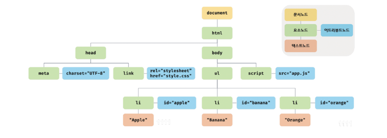

# DOM

브라우저의 렌더링 엔진은 HTML 문서를 파싱하여 브라우저가 이해할 수 있는 자료구조인 DOM을 생성한다. 
DOM 은 HTML 문서의 계층적 구조와 정보를 표현하여 이를 제어할 수 있는 API , 즉 프로퍼티와 메서드를 제공하는 트리 자료구조다.


## 39.1 노드

### 39.1.1 HTML 요소와 노드 객체

HTML 요소는 HTML 문서를 구성하는 개별적인 요소를 의미한다. 


#### 트리 자료구조

트리 자료구조는 노드들의 계층 구조로 이뤄진다.


노드 객체들로 구성된 트리 자료구조를 DOM <sup>Document Object Model</sup>이라 한다.
노드 객체의 트리로 구조화되어 있기 때문에 DOM을 DOM 트리라고 부르기도 한다.

### 39.1.2 노드 객체의 타입

예를 들어, 다음 HTML 문서를 렌더링 엔진이 파싱한다고 생각해보자.

```html
<!doctype html>
<html lang="en">
<head>
    <meta charset="UTF-8">
    <meta name="viewport"
          content="width=device-width, user-scalable=no, initial-scale=1.0, maximum-scale=1.0, minimum-scale=1.0">
    <meta http-equiv="X-UA-Compatible" content="ie=edge">
    <title>Document</title>
    <link rel="stylesheet" href="style.css">
</head>
<body>
    <ul>
        <li id="apple">Apple</li>
        <li id="banana">Banana</li>
        <li id="orange">Orange</li>
    </ul>
    <script src="app.js"></script>
</body>
</html>
```



DOM 은 노드 객체의 계층적인 구조로 구성된다. 
노드 객체는 종류가 있고 상속 구조를 갖는다. 노드 객체는 총 12개의 종류가 있다.
이 중에서 중요한 노드 타입은 다음과 같이 4가지다.


#### 문서 노드

문서 노드는 DOM 트리의 최상위에 존재하는 루트 노드로서 document 객체를 가리킨다.

브라우저 환경의 모든 자바스크립트 코드는 script 태그에 의해 분리되어 있어도 하나의 전역 객체 window를 공유한다.
따라서 모든 자바스크립트 코드는 전역 객체 window의 document 프로퍼티에 바인딩되어 있는 하나의 document 객체를 바라본다.
즉, HTML 문서당 document 객체는 유일하다.


#### 요소 노드

요소 노드는 HTML 요소를 가리키는 객체다. 요소 노드는 HTML 요소 간의 중첩에 의해 부자 관계를 가지며,
이 부자 관계를 통해 정보를 구조화한다. 따라서 요소 노드는 문서의 구조를 표현한다고 할 수 있다.

#### 어트리뷰트 노드

어트리뷰트 노드는 HTML 요소의 어트리뷰트를 가리키는 객체다. 어트리뷰트 노드는 어트리뷰트가 지정된 HTML 요소의
요소 노드와 연결되어 있다.

#### 텍스트 노드

텍스트 노드는 HTML 요소의 텍스트를 가리키는 객체다. 요소 노드가 문서의 구조를 표현하다면 텍스트 노드는 
문서의 정보를 표현한다고 할 수 있다. 텍스트 노드는 요소 노드의 자식 노드이며. 자식 노드를 가질 수 없는 리프 노드이다.


### 39.1.3 노드 객체의 상속 구조

즉, DOM 을 구성하는 노드 객체는 자신의 구조와 정보를 제어할 수 있는 DOM API를 사용할 수 있다. 
이를 통해 노드 객체는 자신의 부모, 형제, 자식을 탐색할 수 있으며, 자신의 어트리뷰트와 텍스트를 조작할 수도 있다.

DOM을 구성하는 노드 객체는 ECMAScript 사양에 정의된 표준 빌트인 객체가 아니라 브라우저 환경에서 추가적으로 제공하는 호스트 객체다.
하지만 노드 객체도 자비스크립트 객체이므로 프로토타입에 의한 상속 구조를 갖는다.


```html
<!DOCTYPE html>
<html lang="en">
<head>
    <meta charset="UTF-8">
    <title>Title</title>
</head>
<body>
 <input type="text">
<script>
  // input 요소 노드 객체를 선택
  const $input = document.querySelector('input');

  // input 요소 노드 객체의 프로토타입 체인
  console.log(
          Object.getPrototypeOf($input) === HTMLInputElement.prototype,
          Object.getPrototypeOf(HTMLInputElement.prototype) === HTMLElement.prototype,
          Object.getPrototypeOf(HTMLElement.prototype) === Element.prototype,
          Object.getPrototypeOf(Element.prototype) === Node.prototype,
          Object.getPrototypeOf(Node.prototype) === EventTarget.prototype,
          Object.getPrototypeOf(EventTarget.prototype) === Object.prototype,
  )// 모두 true
</script>
</body>
</html>
```

배열이 객체인 동시에 배열인 것처럼 input 요소 노드 객체도 다음과 같이 다양한 특성을 갖는 객체이며,
이러한 특성을 나타내는 기능들을 상속을 통해 제공받는다.


노드 객체에는 노드 객체의 종류, 즉 노드 타입에 상관없이 모든 노드 객체가 공통으로 갖는 기능도 있고,
노드 타입에 따라 고유한 기능도 있다. 예를 들어 모든 노드 객체는 공통적으로 이벤트를 발생시킬 수 있다.


HTML 요소가 객체화된 요소 노드 객체는 HTML 요소가 갖는 공통적인 기능이 있다. 예를 들어, input 요소 노드 객체와 
div 요소 노드 객체는 모두 HTML 요소의 스타일을 나타내는 style 프로퍼티가 있다.
이처럼 HTML 요소가 갖는 공통적인 기능은 HTMLElement 인터페이스가 제공한다.


노드 객체는 공통된 기능일수록 프로토타입 체인의 상위에, 개별적인 고유 기능일수록 프로토타입 체인의 하위에 프로토타입 체인을
구축하여 노드 객체에 필요한 기능, 즉 프로퍼티와 메서드를 제공하는 상속 구조를 갖는다.


## 39.2 요소 노드 취득


### 39.2.1 id를 이용한 요소 노드 취득

Document.prototype.getElementById 메서드는 인수로 전달한 id 어트리뷰트 값을 갖는 하나의 요소 노드를 탐색하여 반환한다.


```html
<!doctype html>
<html lang="en">
<head>
    <meta charset="UTF-8">
    <meta name="viewport"
          content="width=device-width, user-scalable=no, initial-scale=1.0, maximum-scale=1.0, minimum-scale=1.0">
    <meta http-equiv="X-UA-Compatible" content="ie=edge">
    <title>Document</title>
    <link rel="stylesheet" href="style.css">
</head>
<body>
<ul>
    <li id="apple">Apple</li>
    <li id="banana">Banana</li>
    <li id="orange">Orange</li>
</ul>
<script>
    // id 값이 'banana' 인 요소 노드를 탐색하여 반환한다.
    // 두 번째 li 요소가 파싱되어 생성된 요소 노드가 반환된다.
    const $elem = document.getElementById("banana");
    
    // 취득한 요소 노드의 style.color 프로퍼티 값을 변경한다.
    $elem.style.color = 'red';
</script>
</body>
</html>
```

id 값은 HTML 문서 내에서 유일한 값이어야 하며, class 어트리뷰트와는 달리 공백 문자로 구분하여 여러 개의 값을 가질 수 없다.
단, HTML 문서 내에 중복된 id 값을 갖는 HTML 요소가 여러 개 존재하더라도 어떠한 에러도 발생하지 않는다. 

즉, HTML 문서 내에는 중복된 id 값을 갖는 요소가 여러 개 존재할 가능성이 있다.
이러한 경우 getElementById 메서드는 인수로 전달된 id 값을 갖는 첫 번째 요소 노드만 반환한다.

만약 인수로 전달된 id 값을 갖는 HTML 요소가 존재하지 않는 경우 getElementById 메서드는 null 을 반환한다.

HTML 요소에 id 어트리뷰트를 부여하면 id 값과 동일한 이름의 전역 변수가 암묵적으로 선언되고 해당 노드 객체가 할당되는 부수 효과가 있다.

```html
<!DOCTYPE html>
<html lang="en">
<head>
    <meta charset="UTF-8">
    <title>Title</title>
</head>
<body>
  <div id="foo"></div>
<script>
  // id 값과 동일한 이름의 전역 변수가 암묵적으로 선언되고 해당 노드 객체가 할당된다.
  console.log(foo === document.getElementById("foo")); // true

  // 암묵적 전역으로 생성된 전역 프로퍼티는 삭제되지만 전역 변수는 삭제되지 않는다.
  delete foo;
  console.log(foo); // <div id="foo"></div>
</script>
</body>
</html>
```

단, id 값과 동일한 이름의 전역 변수가 이미 선언되어 있으면 이 전역 변수에 노드 객체가 재할당되지 않는다.


```html
<!DOCTYPE html>
<html lang="en">
<head>
  <meta charset="UTF-8">
  <title>Title</title>
</head>
<body>
<div id="foo"></div>
<script>
  let foo = 1;
  
  // id 값과 동일한 이름의 전역 변수가 이미 선언되어 있으면 노드 객체가 재할당되지 않는다.
  console.log(foo); // 1
</script>
</body>
</html>
```


### 39.2.2 태그 이름을 이용한 요소 노드 취득

Document.prototype/Element.prototype.getElementsByTagName 메서드는 인수로 전달한 태그 이름을 갖는 모든 요소 노드들을
탐색하여 반환한다. 메서드 이름에 포함된 Elements 가 복수형인 것에서 알 수 있듯이 getElementsByTagName 메서드는 여러 개의 요소 노드 객체를
갖는 DOM 컬렉션 객체인 HTMLCollection 객체를 반환한다.

```html
<!doctype html>
<html lang="en">
<head>
  <meta charset="UTF-8">
  <meta name="viewport"
        content="width=device-width, user-scalable=no, initial-scale=1.0, maximum-scale=1.0, minimum-scale=1.0">
  <meta http-equiv="X-UA-Compatible" content="ie=edge">
  <title>Document</title>
  <link rel="stylesheet" href="style.css">
</head>
<body>
<ul>
  <li id="apple">Apple</li>
  <li id="banana">Banana</li>
  <li id="orange">Orange</li>
</ul>
<script>
  
  // 태그 이름이 li인 요소 노드를 모두 탐색하여 반환한다.
  // 탐색된 요소 노드들은 HTMLCollection 객체에 담겨 반환된다.
  // HTMLCollection 객체는 유사 배열 객체이면서 이터러블이다.
  const $elems = document.getElementsByTagName("li");
  
  
  // 취득한 요소 노드의 style.color 프로퍼티 값을 변경한다.
  // HTMLCollection 객체를 배열로 반환하여 순회하며 color 프로퍼티 값을 변경한다.
  [... $elems].forEach(elem => {elem.style.color = 'red';});
</script>
</body>
</html>
```

함수는 하나의 값만 반환할 수 있으므로 여러 개의 값을 반환하려면 배열이나 객체와 같은 자료구조에 담아 반환해야 한다.
getElementsByTagName 메서드가 반환하는 DOM 컬렉션 객체인 HTMLCollection 객체는 유사 배열 객체이면서 이터러블이다.


getElementsByTagName 메서드는 Document.prototype 에 정의된 메서드와 Element.prototype 에 정의된 메서드가 있다.

```html
<!DOCTYPE html>
<html lang="en">
<head>
    <meta charset="UTF-8">
    <title>Title</title>
</head>
<body>
  <ul id="fruits">
    <li>Apple</li>
    <li>Banana</li>
    <li>Orange</li>
  </ul>
  <ul>
    <li>HTML</li>
  </ul>
<script>
  // DOM 전체에서 태그 이름이 li 인 요소 노드를 모두 탐색하여 반환한다.
  const $lisFromDocument = document.getElementsByTagName('li');
  console.log($lisFromDocument);  // HTMLCollection(4) [li,li,li,li]

  const $fruits = document.getElementById('fruits');
  const $listFromFruits = $fruits.getElementsByTagName('li');
  console.log($listFromFruits); // HTMLCollection(3) [li,li,li]
</script>
</body>
</html>
```


### 39.2.3 class 를 이용한 요소 노드 취득

```html
<!DOCTYPE html>
<html lang="en">
<head>
    <meta charset="UTF-8">
    <title>Title</title>
</head>
<body>
<ul>
  <li class="fruit apple">Apple</li>
  <li class="fruit banana">Banana</li>
  <li class="fruit orange">Orange</li>
</ul>
<script>
  // class 값이 'fruit' 인 요소 노드를 모두 탐색하여 HTMLCollection 객체에 담아 반환한다.
  const $elems = document.getElementsByClassName('fruit');
  
  // 취득한 모든 요소의 CSS Color 프로퍼티 값을 변경한다.
  [...$elems].forEach(elem=> {elem.style.color = 'red';});
  
  // class 값이 'fruit apple'인 요소 노드를 모두 탐색하여 HTMLCollection 객체에 담아 반환한다.
  const $apple = document.getElementsByClassName('fruit apple');
  
  // 취득한 모든 요소 노드의 style.color 프로퍼티 값을 변경한다.
  [...$apple].forEach(elem => {elem.style.color = 'blue';});
</script>
</body>
</html>
```

getElementsByTagName 메서드와 마찬가지로 getElementByClassName 메서드는 Document.prototype 에 정의된 메서드와
Element.prototype 에 정의된 메서드가 있다.