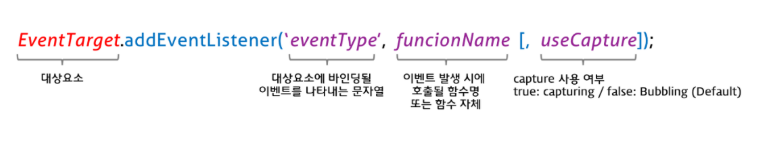

# 이벤트 

## 40.1 이벤트 드리븐 프로그래밍

브라우저는 처리해야 할 특정 사건이 발생하면 이를 감지하여 이벤트를 발생 시킨다.
예를 들어, 클릭 , 키보드 입력, 마우스 이동 등이 일어나면 브라우저는 이를 감지하여 특정한 타입의 이벤트를 발생시킨다.

만약 애플리케이션이 특정 탕비의 이벤트에 대해 반응하여 어떤 일을 하고 싶다면 해당하는 타입의 이벤트가
발생했을 때 호출될 함수를 브라우저에게 알려 호출을 위임한다. 이때 이벤트가 발생했을 때 호출될 함수를 이벤트 핸들러라 하고,

이벤트가 발생했을 때 브라우저에게 이벤트 핸들러의 호출을 위임하는 것을 이벤트 핸들러 등록이라 한다.


이벤트와 그에 대응하는 함수를 통해 사용자와 애플리케이션은 상호작용 할 수 있다.
이와 같이 프로그램의 흐름을 이벤트 중심으로 제어하는 프로그래밍 방식을 이벤트 드리븐 프로그래밍이라 한다.

## 40.2 이벤트 타입

이벤트 타입은 이벤트의 종류를 나타내는 문자열이다.

### 40.2.1 마우스 이벤트


### 40.2.2 키보드 이벤트


### 40.2.3 포커스 이벤트


focusin , focusout 이벤트 핸들러를 이벤트 핸들러 프로퍼티 방식으로 등록하면, 크롬, 사파리에서 정상 동작하지 않는다.

focusin, focusout 이벤트 핸들러는 addEventListener 메서드 방식을 사용해 등록해야 한다.

### 40.2.4 폼 이벤트


### 40.2.5 값 변경 이벤트


### 40.2.6 DOM 뮤테이션 이벤트

- DOMContentLoaded  : HTML 문서의 로드와 파싱이 완료되어 DOM 생성이 완료되었을 때

### 40.2.7 뷰 이벤트

- resize : 브라우저 윈도우 크기를 리사이즈할 때 연속적으로 발생한다.
- scroll : 웹페이지 또는 HTML 요소를 스크롤할 때 연속적으로 발생한다.

### 40.2.8 리소스 이벤트


- load : DOMContentLoaded 이벤트가 발생한 이후, 모든 리소스의 로딩이 완료되었을 때
- unload : 리소스가 언로드될 때 (주로 새로운 웹페이지를 요청한 경우)
- abort : 리소스 로딩이 중단되었을 때
- error : 리소스 로딩이 실패했을 때


## 40.3 이벤트 핸들러 등록

이벤트 핸들러는 이벤트가 발생했을 때 브라우저에 호출을 위임한 함수다. 
다시 말해, 이벤트가 발생하면 브라우저에 의해 호출될 함수가 이벤트 핸들러다.

이벤트가 발생했을 때 브라우저에게 이벤트 핸들러의 호출을 위임하는 것을 이벤트 핸들러 등록이라 한다.

### 40.3.1 이벤트 핸들러 어트리뷰트 방식

HTML 요소의 어트리뷰트 중에는 이벤트에 대응하는 이벤트 핸들러 어트리뷰트가 있다.
이벤트 핸들러 어트리뷰트의 이름은 onclick과 같이 on 접두사와 이벤트의 종류를 나타내는 이벤트 타입으로 이루어져 있다.


```html
<!DOCTYPE html>
<html lang="en">
<head>
    <meta charset="UTF-8">
    <title>Title</title>
</head>
<body>
  <button onclick="sayHi('pgh')"> Click me!</button>
  <script>
    function sayHi(name){
        console.log(`Hi ! ${name}.`);
    }
  </script>
</body>
</html>
```

주의할 점은 이벤트 핸들러 어트리뷰트 값으로 함수 참조가 아닌 함수 호출문 등의 문을 할당한다는 것이다.
다음에 살펴볼 "이벤트 핸들러 프로퍼티 방식"에서는 DOM 노드의 이벤트 핸들러 프로퍼티에 함수 참조를 할당한다.

이벤트 핸들러 어트리뷰트 방식은 오래된 코드에서 간혹 이 방식을 사용한 것이 있기 때문에 알아둘 필요는 있지만
더는 사용하지 않는 것이 좋다.  HTML 과 자바스크립트는 관심사가 다르므로 혼재하는 것보다 분리하는 것이 좋다.

하지만 모던 자바스크립트에서는 이벤트 핸들러 어트리뷰트 방식을 사용하는 경우가 있다.

### 40.3.2 이벤트 핸들러 프로퍼티 방식

window 객체와 Document , HTMLElement 타입의 DOM 노드 객체는 이벤트에 대응하는 이벤트 핸들러 프로퍼티를 가지고 있다.
이벤트 핸들러 프로퍼티의 키는 이벤트 핸들러 어트리뷰트와 마찬가지로 onclick과 같이 on 접두사와 이벤트의 종류를 나타내는 
이벤트 타입으로 이루어져 있다.

이벤트 핸들러 프로퍼티에 함수를 바인딩하면 이벤트 핸들러가 등록된다.

```html
<!DOCTYPE html>
<html lang="en">
<head>
    <meta charset="UTF-8">
    <title>Title</title>
</head>
<body>
 <button>Click me!</button>
<script>
  const $button = document.querySelector('button');

  // 이벤트 핸들러 프로퍼티에 이벤트 핸들러를 바인딩
  $button.onclick = function (){
    console.log('button click');
  }
</script>
</body>
</html>
```

이벤트 핸들러를 등록하기 위해서는 이벤트를 발생시킬 객체인 이벤트 타깃과 이벤트의 종류를 나타내는 문자열인
이벤트 타입 그리고 이벤트 핸들러를 지정할 필요가 있다. 예를 들어, 버튼 요소가 클릭되면 
handleClick 함수를 호출하도록 이벤트 핸들러를 등록하는 경우 이벤트 타깃은 버튼 요소이고
이벤트 타입은 'click'이며 이벤트 핸들러는 handleClick 함수다.


### 40.3.3 addEventListener 메서드 방식

DOM level 2 에서 도입된 EventTarget.prototype.addEventListener 메서드를 사용하여 이벤트 핸들러를 등록할 수 있다.
앞서 살펴본 "이벤트 핸들러 어트리뷰트 방식"과 "이벤트 핸들러 프로퍼티 방식"은 DOM Level 0부터 제공되던 방식이다.



동일한 HTML 요소에서 발새한 이벤트에 대해 이벤트 핸들러 프로퍼티 방식은 하나 이상의 이벤트 핸들러를 등록할 수 없지만
addEventListener 메서드는 하나 이상의 이벤트 핸들러를 등록할 수 있다. 

이때 이벤트 핸들러는 등록된 순서대로 호출된다.

```html
<!DOCTYPE html>
<html lang="en">
<head>
    <meta charset="UTF-8">
    <title>Title</title>
</head>
<body>
    <button>Click me !</button>
    <script>
        const $button = document.querySelector('button');

        $button.addEventListener('click', function (){
            console.log('1- button click');
        });

        $button.addEventListener('click', function (){
            console.log('2 - button click');
        })
    </script>
</body>
</html>
```


## 40.4 이벤트 핸들러 제거

addEventListener 메서드로 등록한 이벤트 핸들러를 제거하려면 EventTarget.prototype.removeEventListener 메서드를 사용한다.

removeEventListener 메서드에 전달할 인수는 addEventListener 메서드와 동일하다.
단, addEventLister 메서드에 전달한 인수와 removeEventListener 메서드에 전달한 인수가 일치하지 않으면 이벤트 핸들러가
제거되지 않는다.

```html
<!DOCTYPE html>
<html lang="en">
<head>
  <meta charset="UTF-8">
  <title>Title</title>
</head>
<body>
<button>Click me!</button>
<script>
    const $button = document.querySelector('button');

    const handleClick = () => console.log('button click');

    // 이벤트 핸들러 등록
    $button.addEventListener('click',handleClick);

    // 이벤트 핸들러 제거
    $button.removeEventListener('click', handleClick, true); // 실패
    $button.removeEventListener('click', handleClick); // 성공

</script>
</body>
</html>
```

## 40.5 이벤트 객체

이벤트가 발생하면 이벤트에 관련한 다양한 정보를 담고 있는 이벤트 객체가 동적으로 생성된다. 생성된 이벤트 객체는
이벤트 핸들러의 첫 번째 인수로 전달된다. 

```html
<!DOCTYPE html>
<html lang="en">
<head>
    <meta charset="UTF-8">
    <title>Title</title>
</head>
<body>
  <p>클릭하세요. 클릭한 곳의 좌표가 표시된다.</p>
  <em class="message"></em>
  <script>
    const $msg = document.querySelector('.message');
    // 클릭 이벤트에 의해 생성된 이벤트 객체는 이벤트 핸들러의 첫 번째 인수로 전달된다.
    function showCoords(e){
      $msg.textContent = `clientX : ${e.clientX} , clientY : ${e.clientY}`;
    }
    document.onclick = showCoords;
  </script>
</body>
</html>
```

### 40.5.1 이벤트 객체의 상속 구조

이벤트가 발생하면 이벤트 타입에 따라 다양한 타입의 이벤트 객체가 생성된다.
이벤트 객체는 다음과 같은 상속 구조를 갖는다.


### 40.5.2 이벤트 객체의  공통 프로퍼티

Event 인터페이스, 즉 Event.prototype 에 정의되어 있는 이벤트 관련 프로퍼티는 UIEvent , CustomEvent ,
MouseEvent 등 모든 파생 이벤트 객체에 상속된다. 즉, Event 인터페이스의 이벤트 관련 프로퍼티는 모든 이벤트 객체가
상속받는 공통 프로퍼티다. 


### 40.5.3 마우스 정보 취득


### 40.5.4 키보드 정보 취득

## 이벤트 전파

DOM 트리 상에 존재하는 DOM 요소 노드에서 발생한 이벤트는 DOM 트리를 통해 전파된다.
이를 이벤트 전파라고 한다.


- 캡처링 단계 : 이벤트가 상위 요소에서 하위 요소 방향으로 전파
- 타깃 단계 : 이벤트가 이벤트 타깃에 전달
- 버블링 단계 : 이벤트가 하위 요소에서 상위 요소 방향으로 전파


```html
<!DOCTYPE html>
<html lang="en">
<head>
    <meta charset="UTF-8">
    <title>Title</title>
</head>
<body>
  <ul id="fruits">
    <li id="apple">Apple</li>
    <li id="banana">Banana</li>
    <li id="orange">Orange</li>
  </ul>
<script>
  const $fruits = document.getElementById('fruits');

  $fruits.addEventListener('click' , e => {
    console.log(`이벤트 단계 : ${e.eventPhase}`) // 3 : 버블링 단계
    console.log(`이벤트 타깃 : ${e.target}`) //   [object HTMLLIElement]
    console.log(`커런트 타깃 : ${e.currentTarget}`) // [object HTMLUListElement]
  })
</script>
</body>
</html>
```

li 요소를 클릭하면 클릭 이벤트가 발생하여 클릭 이벤트 객체가 생성되고 클릭된 li 요소가 이벤트 타깃이 된다.
이때 클릭 이벤트 객체는 window 에서 시작해서 이벤트 타깃 방향으로 전파된다. 이것이 캡처링 단계다.

이후 이벤트 객체는 이벤트를 발생시킨 이벤트 타킷에 도달한다. 이것이 타깃 단계다. 
이후 이벤트 객체는 이벤트 타겟에서 시작해서 window 방향으로 전파된다. 이것이 버블링 단계다.
