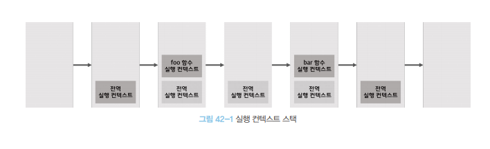
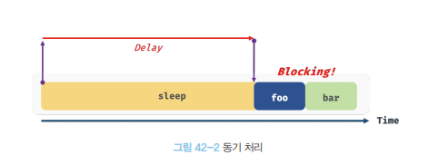
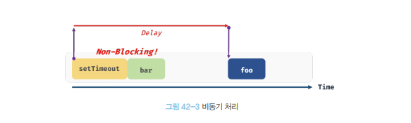
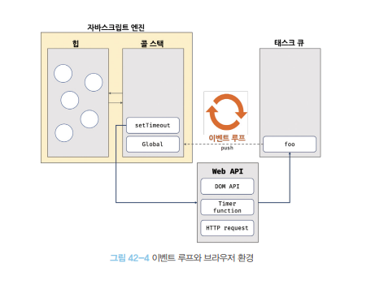

# 비동기 프로그래밍

## 42.1 동기 처리와 비동기 처리

함수를 호출하면 함수 코드가 평가되어 함수 실행 컨텍스트가 생성된다.
이때 생성된 함수 실행 컨텍스트는 실행 컨텍스트 스택(콜 스택이라고 부른다)에 푸시되고 
함수 코드가 실행된다. 

함수 코드의 실행이 종료하면 함수 실행 컨텍스트는 실행 컨텍스트 스택에서 팝되어 제거 된다. 


```javascript
const foo = () => {};
const bar = () => {};

foo();
bar();
```



함수가 호출된 순서대로 순차적으로 실행되는 이유는 함수가 호출된 순서대로 함수 실행 컨텍스트가 
실행 컨텍스트 스택에 푸시되기 때문이다.  이처럼 함수의 실행 순서는 실행 컨텍스트 스택으로 관리한다.

자바스크립트 엔진은 단 하나의 실행 컨텍스트 스택을 갖는다. 


자바스크립트 엔진은 한 번에 하나의 태스크만 실행할 수 있는 싱글 스레드 방식으로 동작한다.
싱글 스레드 방식은 한 번에 하나의 태스크만 실행할 수 있기 때문에 처리에 시간이 걸리는 태스크를 실행하는 
경우 블로킹 (작업 중단)이 발생한다. 


```javascript
// sleep 함수는 일정 시간이 경과된 이후에 콜백 함수를 호출한다.
function sleep(func ,delay) {
    // Date.now() 는  현재 시간을 숫자로 반환한다.
    const delayUntil = Date.now() + delay;

    // 현재 시간(Date.now())에 delay를 더한 delayUntil 이 현재 시간보다 작으면 계속 반복한다.
    while(Date.now() < delayUntil)
        // 일정 시간이 경과된 이후에 콜백 함수를 호출한다.
        
        
        
        func();
}

function foo(){
    console.log('foo');
}

function bar(){
    console.log("bar");
}

sleep(foo, 3*1000);

// bar 함수는 sleep 함수의 실행이 종료된 이후에 호출되므로 3초 이상 블로킹 된다.
bar();
```

sleep 함수는 3초 후에 foo 함수를 호출한다. 이때 bar 함수는 sleep 함수의 실행이
종료된 이후에 호출되므로 3초 이상 호출되지 못하고 블로킹 된다.


이처럼 현재 실행 중인 테스크가 종료할 때까지 다음에 실행될 테스크가 대기하는 방식을 동기 처리라고 한다.
동기 처리 방식은 태스크를 순서대로 하나씩 처리하므로 실행 순서가 보장된다는 장점이 있지만,
앞선 태스크가 종료할 때까지 이후 태스크들이 블로킹되는 단점이 있다.




```javascript

function foo(){
    console.log('foo');
}

function bar(){
    console.log("bar");
}

// 타이머 함수 setTimeout 은 일정 시간이 경과된 이후에 콜백 함수 foo를 호출한다.
// 타이머 함수 setTimeout 은 bar 함수를 블로킹하지 않는다.
setTimeout(foo, 3*1000);


bar();
```

setTimeout 함수는 앞서 살펴본 sleep 함수와 유사하게 일정 시간이 경과된 이후에 콜백 함수를 호출하지만 
setTimeout 함수 이후의 태스크를 블로킹하지 않고 곧바로 실행한다. 
이처럼 현재 실행 중인 태스크가 종료되지 않은 상태라 해도 다음 태스크를 곧바로 실행하는 방식을 비동기 처리라고 한다. 



동기 처리 방식은 태스크를 순서대로 하나씩 처리하므로 실행 순서가 보장된다는 장점이 있지만,
앞선 태스크가 종료할 때까지 이후 태스크들이 블로킹 되는 단점이 있었다.
비동기 처리 방식은 현재 실행 중인 태스크가 종료되지 않은 상태라 해도 다음 태스크를 곧바로 실행하므로
블로킹이 발생하지 않는다는 장점이 있지만, 태스크의 실행 순서가 보장되지 않는 단점이 있다.

타이머 함수인 setTimeout 과 setInterval, HTTP 요청, 이벤트 핸들러는 비동기 처리 방식으로 동작한다.
비동기 처리는 이벤트 루프와 태스크 큐와 깊은 관계가 있다.

### 42.2 이벤트 루프와 태스크 큐

자바스크립트의 특징 중 하나는 싱글 스레르로 동작한다는 것이다. 앞서 살펴본 바와 같이 싱글 스레드 방식은 한 번에
하나의 태스크만 처리할 수 있다는 것을 의미한다. 하지만 브라우저가 동작하는 것을 살펴보면 많은 태스크가 동시에 처리되는 것처럼 느껴진다.

예를 들어, HTML 요소가 애니메이션 효과를 통해 움직이면서 이벤트를 처리하기도 하고, HTTP 요청을 통해 서버로부터
데이터를 가지고 오면서 렌더링하기도 한다. 이처럼 자바스크립트의 동시성을 지원하는 것이 바로
이벤트 루프다.

이벤트 루프는 브라우저에 내장되어 있는 기능 중 하나다. 
브라우저 환경을 그림으로 표현하면 다음과 같다.



구글의 V8 자바스크립트 엔진을 비롯한 대부분의 자바스크립트 엔진은 크게 2개의 영역으로 구분할 수 있다.

- 콜 스택

소스코드 평가 과정에서 생성된 실행 컨텍스트가 추가되고 제거된느 스택 자료구조인 실행 컨텍스트 스택이 바로 콜 스택이다.
함수를 호출하면 함수 실행 컨텍스트가 순차적으로 콜 스택에 푸시되어 순차적으로 실행된다. 
자바스크립트 엔진은 단 하나의 콜 스택을 사용하기 때문에 최상위 실행 컨텍스트가 종료되어 콜 스택에서 제거되기 전까지는 
다른 어떤 태스크도 실행되지 않는다. 


- 힙

힙은 객체가 저장되는 메모리 공간이다. 콜 스택의 요소인 실행 컨텍스트는 힙에 저장된 객체를 참조한다. 
메모리에 값을 저장하려면 먼저 값을 저장할 메모리 공간의 크기를 결정해야 한다. 
객체는 원시 값과는 달리 크기가 정해져 있지 않으므로 
할당해야 할 메모리 공간의 크기를 런타임에 결정해야 한다. 따라서 객체가 저장되는 메모리 공간인 힙은 구조화 되어 있지 않다는 특징이 있다.


이처럼 콜 스택과 힙으로 구성되어 있는 자바스크립트 엔진은 단순히 태스크가 요청되면 콜 스택을 통해 요청된 
작업을 순차적으로 실행할 뿐이다. 

비동기 처리에서 소스코드의 평가와 실행을 제외한 모든 처리는 자바스크립트 엔진을 구동하는 환경인 브라우저 또는 Node.js 가 담당한다.

예를 들어. 비동기 방식으로 동작하는 setTimeout 의 콜백 함수의 평가와 실행은 자바스크립트 엔진이 담당하지만
호출 스케줄링을 위한 타미어 설정과 콜백 함수의 등록은 브라우저 또는 Node.js 가 담당한다. 