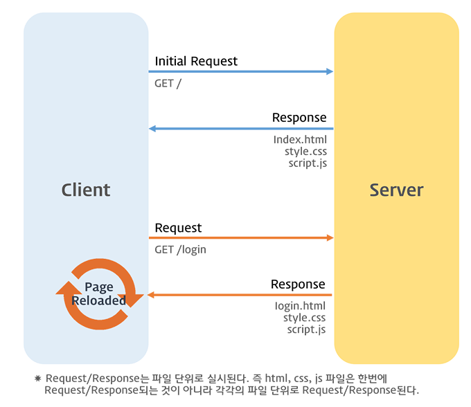
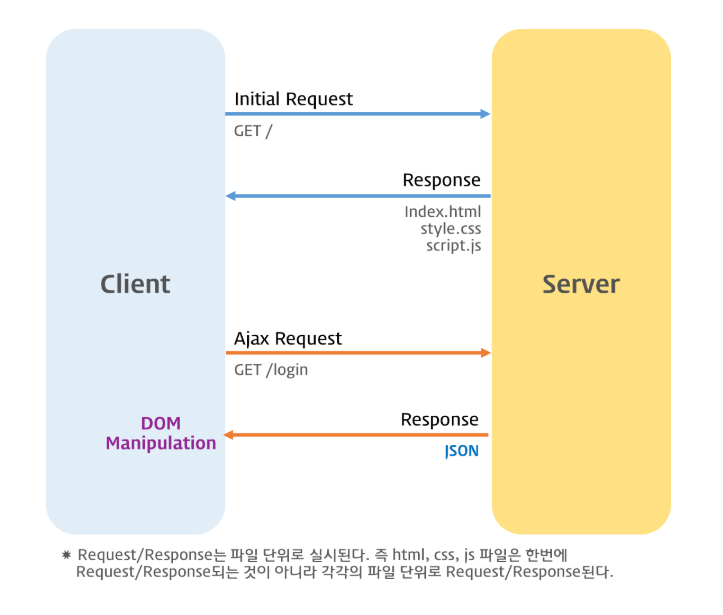
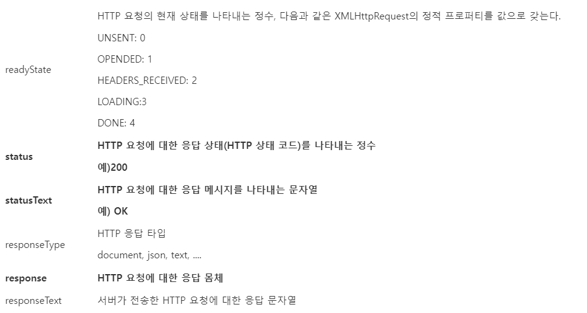
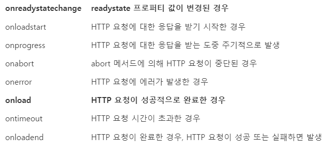
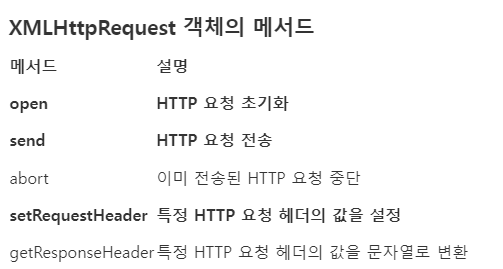
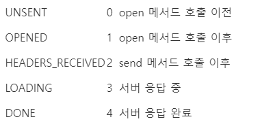
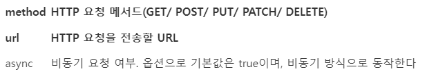
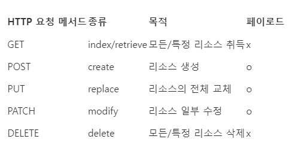
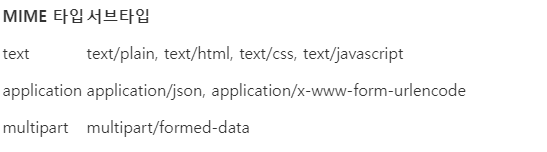

# Ajax

## 43.1 Ajax 란?

Ajax <sup>Asynchronous Javascript and XML</sup> 란
자바스크립트를 사용하여 브라우자거 서버에게 비동기 방식으로 데이터를 요청하고,
서버가 응답한 데이터를 수신하여 웹 페이지를 동적으로 갱신하는 프로그래밍 방식을 말한다.

Ajax 는 브라우저에게 제공하는 Web API 인 XMLHttpRequest 객체를 기반으로 동작한다. 

XMLHttpRequest 는 HTTP 비동기 통신을 위한 메서드와 프로퍼티를 제공한다.

1999년 마이크로소프트가 개발한 XMLHttpRequest 는 그다지 큰 주목을 받지 못하다가 
2005년 구글이 발표한 구글 맵스를 통해 웹 애플리케이션 개발 프로그래밍 언어로서 자바스크립트의 가능성을
확인하는 계기를 마련했다.

웹 브라우저에서 자바스크립트와 Ajax 를 기반으로 동작하는 구글 맵스가 데스크톱 애플리케이션과 비교해
손색이 없을 정도의 퍼포먼스와 부드러운 화면 전환 효과를 보여준 것이다.

이전의 웹페이지는 html 태그로 시작해서 html 태그로 끝나는 완전한 HTML을 서버로부터 전송받아 
웹페이지 전체를 처음부터 다시 렌더링하는 방식으로 동작했다. 따라서 화면이 전환되면 서버로부터
새로운 HTML을 전송받아 웹 페이지 전체를 처음부터 다시 렌더링했다.



이러한 전통적인 방식은 다음과 같은 단점이 있다.

- 이전 웹페이지와 차이가 없어서 변경할 필요가 없는 부분까지 포함된 완전한 HTML을 서버로부터 매번 다시 전송받기 때문에 불필요한 데이터 통신이 발생한다.
- 변경할 필요가 없는 부분까지 처음부터 다시 렌더링한다. 이로 인해 화면 전환이 일어나면 화면이 순간적으로 깜빡이는 현상이 발생한다.
- 클라이언트와 서버와의 통신이 동기 방식을 동작하기 때문에 서버로부터 응답이 있을 때까지 다음 처리는 블로킹 된다. 




Ajax 는 전통적인 방식과 비교했을 때 다음과 같은 장점이 있다.

- 변경할 부분을 갱신하는 데 필요한 데이터만 서버로부터 전송받기 때문에 불필요한 데이터 통신이 발생하지 않는다.
- 변경할 필요가 없는 부분은 다시 렌더링하지 않는다. 따라서 화면이 순간적으로 깜빡이는 현상이 발생하지 않는다.
- 클라이언트와 서버와의 통신이 비동기 방식으로 동작하기 때문에 서버에게 요청을 보낸 이후 블로킹이 발생하지 않는다. 


## 43.2 JSON

JSON <sup>Javascript Object Notation</sup> 은 클라이언트와 서버 간의 HTTP 통신을 위한 텍스트 데이터 포맷이다.
자바스크립트에 종속되지 않는 언어 독립형 데이터 포맷으로, 대부분의 프로그래밍 언어에서 사용할 수 있다.

### 43.2.1 JSON 표기 방식

JSON 은 자바스크립트 객체 리터럴과 유사하게 키와 값으로 구성된 순수한 텍스트다.

```json
{
  "name" : "Lee", 
  "age" : 20, 
  "alive" : true, 
  "hobby" : ["traveling", "tennis"]
}
```

JSON의 키는 반드시 큰따옴표(작은 따옴표 사용 불가)로 묶어야 한다.
값은 객체 리터럴과 같은 표기법을 그대로 사용할 수 있다. 
하지만 문자열은 반드시 큰따음표(작은따옴표 사용 불가)로 묶어야 한다.


### 43.2.2 JSON.stringify

JSON.stringify 메서드는 객체를 JSON 포맷의 문자열로 변환한다.

클라이언트가 서버로 객체를 전송하려면 객체를 문자열화해야 하는데 
이를 직렬화라 한다.


```json
const obj = {
    name: "Lee",
    age: 20,
    alive: true,
    hobby: ['traveling', 'tennis']
}

console.log(obj);

// 객체를 JSON 포맷의 문자열로 변환한다.
const json = JSON.stringify(obj);
console.log(typeof json, json);
// string {"name":"Lee","age":20,"alive":true,"hobby":["traveling","tennis"]}


// 객체를 JSON 포맷의 문자열로 변환하면서 들여쓰기 한다.
const prettyJson = JSON.stringify(obj, null, 2);
console.log(typeof prettyJson, prettyJson);


// replacer 함수, 값의 타입이 Number 이면 필터링되어 반환되지 않는다.
function filter(key, value) {
    // undefined : 반환되지 않음
    return typeof value === 'number' ? undefined : value;
}

// JSON.stringify 메서드에 두 번째 인수로 replacer 함수를 전달한다.
const strFilteredObject = JSON.stringify(obj, filter, 2);
console.log(typeof strFilteredObject, strFilteredObject);
/*
string {
    "name": "Lee",
        "alive": true,
        "hobby": [
        "traveling",
        "tennis"
    ]
}
*/
```

JSON.stringfy 메서드는 객체뿐만 아니라 배열도 JSON 포맷의 문자열로 변환한다. 

```javascript
const todos = [
    {id : 1 , content : 'HTML' , completed : false},
    {id : 2 , content : 'CSS' , completed : true},
    {id : 3 , content : 'JavaScript' , completed : false},
]

// 배열을 JSON 포맷의 문자열로 변환한다.
const json = JSON.stringify(todos, null ,2);
console.log(typeof json , json);
/*
string [
    {
        "id": 1,
        "content": "HTML",
        "completed": false
    },
        {
            "id": 2,
            "content": "CSS",
            "completed": true
        },
        {
            "id": 3,
            "content": "JavaScript",
            "completed": false
        }
    ]
*/
```


### 43.2.3 JSON.parse

JSON.parse 메서드는 JSON 포맷의 문자열을 객체로 변환한다. 
서버로부터 클라이언트에게 전송된 JSON 데이터는 문자열이다. 
이 문자열을 객체로서 사용하려면 JSON 포맷의 문자열을 객체화해야 하는데 이를 역직렬화라 한다.

```javascript
const obj = {
    name : 'Lee',
    age : 20,
    alive : true,
    hobby: ['traveling' , 'tennis']
};

// 객체를 JSON 포맷의 문자열로 변환한다.
const json = JSON.stringify(obj);

// JSON 포맷의 문자열을 객체로 변환한다.
const parsed = JSON.parse(json);
console.log(typeof parsed , parsed);
// object { name: 'Lee', age: 20, alive: true, hobby: [ 'traveling', 'tennis' ] }
```

배열이 JSON 포맷의 문자열로 변환되어 있는 경우 JSON.parse 는 문자열을 배열 객체로 변환한다.
배열의 요소가 객체인 경우 배열의 요소까지 객체로 변환한다.

```javascript
const todos = [
    {id : 1 , content : 'HTML' , completed : false},
    {id : 2 , content : 'CSS' , completed : true},
    {id : 3 , content : 'JavaScript' , completed : false},
]

// 배열을 JSON 포맷의 문자열로 변환한다.
const json = JSON.stringify(todos, null ,2);
console.log(typeof json , json);
/*
string [
    {
        "id": 1,
        "content": "HTML",
        "completed": false
    },
        {
            "id": 2,
            "content": "CSS",
            "completed": true
        },
        {
            "id": 3,
            "content": "JavaScript",
            "completed": false
        }
    ]
*/

// JSON 포맷의 문자열을 배열로 반환한다. 배열의 요소까지 객체로 변환된다.
const parsed = JSON.parse(json);
console.log(typeof parsed, parsed);
/*
object [
    { id: 1, content: 'HTML', completed: false },
        { id: 2, content: 'CSS', completed: true },
        { id: 3, content: 'JavaScript', completed: false }
    ]
*/
```

## 43.3 XMLHttpRequest

브라우저는 주소창이나 HTML 의 form 태그 또는 a 태그를 통해 HTTP 요청 전송 기능을 기본 제공한다.

자바스크립트를 사용하여 HTTP 요청을 전송하려면 XMLHttpRequest 객체를 사용한다. Web API인 
XMLHttpRequest 객체는 Http 요청 전송과 HTTP 응답 수신을 위한 다양한 메서드와 프로퍼티를 제공한다.

### 43.3.1 XMLHttpRequest 객체 생성

XMLHttpRequest 객체는 XMLHttpRequest 생성자 함수를 호출하여 생성한다. XMLHttpRequest 객체는
브라우저에서 제공하는 Web API 이므로 브라우저 환경에서만 정상적으로 실행된다.

```javascript
// XMLHttpRequest 객체의 생성
const xhr = new XMLHttpRequest();
```

## 43.3.2 XMLHTTPRequest 객체의 프로퍼티와 메서드

XMLHttpRequest 객체는 다양한 프로퍼티와 메서드를 제공한다. 대표적인 프로퍼티와 메서드는 다음과 같다.

#### XMLHttpRequest 객체의 프로토타입 프로퍼티




#### XMLHttpRequest 객체의 이벤트 핸들러 프로퍼티




#### XMLHttpRequest 객체의 메서드




#### XMLHttpRequest 객체의 정적 프로퍼티



### 43.3.3 HTTP 요청 전송

HTTP 요청을 전송하는 경우 다음 순서를 따른다.

- XMLHttpRequest.prototype.open 메서드로 HTTP 요청을 초기화한다.
- 필요에 따라 XMLRHttpRequest.prototype.setRequestHeader 메서드로 특정 HTTP 요청의 헤더 값을 설정한다.
- XMLHttpRequest.prototype.send 메서드로 HTTP 요청을 전송한다.

```javascript
// XMLHttpRequest 객체 생성
const xhr = new XMLHttpRequest();

// HTTP 요청 초기화
xhr.open('GET', '/users');

// HTTP 요청 헤더 설정
// 클라이언트가 서버로 전송할 데이터의 MIME 타입 지정: json
xhr.setRequestHeader('content-type', 'application/json');


// HTTP 요청 전송
xhr.send();
```

#### XMLHttpRequest.prototype.open

open 메서드는 서버에 전송할 HTTP 요청을 초기화한다. open 메서드를 호출하는 방법은 다음과 같다.

```javascript
xhr.open(method , url[, async])
```




HTTP 요청 메서드는 클라이언트가 서버에 요청의 종류와 목적 (리소스에 대한 행위) 을 알리는 방법이다.
주로 5가지 요청 메서드(GET , POST ,PUT , PATCH ,DELETE 등)를 사용하여 CRUD를 구현한다.




#### XMLHttpRequest.prototype.send

send 메서드는 open 메서드로 초기화된 HTTP 요청을 서버에 전송한다. 
기본적으로 서버로 전송하는 데이터는 GET , POST 요청 메서드에 따라 전송 방식에 차이가 있다.

- GET 요청 메서드의 경우 데이터를 URL의 일부분인 쿼리 문자열로 서버에 전송한다.
- POST 요청 메서드의 경우 데이터를 요청 몸체에 담아 전송한다.


send 메서드에는 요청 몸체에 담아 전송할 데이터를 인수로 전달할 수 있다. 페이로드가 객체인 경우
반드시 JSON.stringify 메서드를 사용하여 직렬화한 다음 전달해야 한다.

```javascript
xhr.send(JSON.stringify({id : 1 , content : 'HTML' , completed : false}));
```

HTTP 요청 메서드가 GET인 경우  send 메서드에 페이로드로 전달한 인수는 무시되고 요청 몸체는 null로 설정된다.

#### XMLHttpRequest.prototype.setRequestHeader

setRequestHeader 메서드는 특정 HTTP 요청의 헤더 값을 설정한다. setRequestHeader 메서드는 반드시 open 메서드를 호출한 이후에
호출해야 한다. 자주 사용하는 HTTP 요청 헤더인 Content-type 과 Accept에 대해 살펴보자

Content-type 은 요청 몸체에 담아 전송할 데이터의 MIME 타입의 정보를 표현한다. 자주 사용되는 MIME 타입은 다음과 같다.



```javascript
// XMLHttpRequest 객체 생성
const xhr = new XMLHttpRequest();

// HTTP 요청 초기화
xhr.open('POST','/users');

// HTTP 요청 헤더 설정
// 클라이언트가 서버로 전송할 데이터의 MIME 타입 지정 : json
xhr.setRequestHeader('content-type', 'application/json' );

// Http 요청 전송
xhr.send(JSON.stringify({id : 1 ,content : 'HTML' , completed : false}));
```

HTTP 클라이언트가 서버에 요청할 때 서버가 응답할 데이터의 MIME 타입을 Accept 로 지정할 수 있다.

```javascript
xhr.setRequestHeader('accept', 'application/json')
```

만약 Accept 헤더를 설정하지 않으면 send 메서드가 호출될 때 Accept 헤더가 */*으로 전송된다.


### 43.3.4. HTTP 응답 처리

서버가 전송한 응답을 처리하려면 XMLHttpRequest 객체가 발생시키는 이벤트를 캐치해야 한다.

```javascript
// XMLHttpRequest 객체 생성
const xhr = new XMLHttpRequest();

// HTTP 요청 초기화
xhr.open('GET', 'https://jsonplaceholder.typicode.com/todos/1');

// HTTP 요청 전송
xhr.send();


// readystatechange 이벤트는 HTTP 요청의 현재 상태를 나타내는 readyState 프로퍼티가
// 변경될 때마다 발생한다.
xhr.onreadystatechange = () => {
    // readyState 프로퍼티는 HTTP 요청의 현재 상태를 나타낸다.
    // readyState 프로퍼티 값이 4(XMLHttpRequest.DONE) 가 아니면 서버 응답이 완료되지 않은 상태다.

    // 만약 서버 응답이 아직 완료되지 않았다면 아무런 처리를 하지 않는다.
    if(xhr.readyState !== XMLHttpRequest.DONE) return ;

    // status 프로퍼티는 응답 상태 코드를 나타낸다.
    // status 프로퍼티 값이 200이면 정상적으로 응답된 상태이고
    // status 프로퍼티 값이 200이 아니면 에러가 발생한 상태다.
    // 정상적으로 응답된 상태라면 response 프로퍼티에 서버의 응답 결과가 담겨 있다.
    if(xhr.status === 200) {
        console.log(JSON.parse(xhr.response));
    }else {
        console.error('Error', xhr.status , xhr.statusText);
    }
}
```

send 메서드를 통해 HTTP 요청을 서버에 전송하면 서버는 응답을 반환한다. 
하지만 언제 응답이 클라이언트에 도달할지는 알 수 없다.
따라서 readystatechange 이벤트를 통해 HTTP 요청의 현재 상태를 확인해야 한다.

readystatechage 이벤트는 HTTP 요청의 현재 상태를 나타내는 readyState 프로퍼티가 변경될 때마다 발생한다.