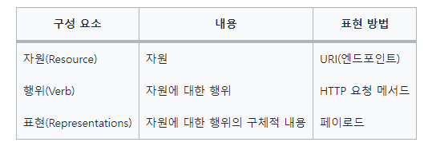
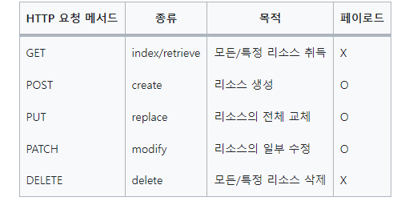

# REST API

REST <sup>REpresentational State Transfer</sup> 는 HTTP/1.0 과 1.1 의 스팩 작성에 참여했고 아파치 HTTP 서버 프로젝트의
공동 설립자인 로이 필딩의 2000년 논문에서 처음 소개되었다.


## 44.1 REST API의 구성

REST API는 자원, 행위, 표현의 3가지 요소로 구성된다.
REST는 자체 표현 구조로 구성되어 REST API 만으로 HTTP 요청의 내용을 이해할 수 있다.




## 44.2 REST API 설계 원칙

REST 에서 가장 중요한 기본적인 원칙은 두 가지다. URI 는 리소스를 표현하는 데 집중하고 행위에 대한 
정의는 HTTP 요청 메서드를 통해 하는 것이 RESTful API를 설계하는 중심 규칙이다.


#### 1. URI는 리소를 표현해야 한다.

URI는 리소스를 표현하는 데 중점을 두어야 한다. 리소를 식별할 수 있는 이름은 동사보다는 명사를 사용한다. 

따라서 이름에 get 같은 행위에 대한 표현이 들어가서는 안 된다.


#### 2. 리소으에 대한 행위는 HTTP 요청 메서드로 표현한다. 

HTTP 요청 메서드는 클라이언트가 서버에게 요청의 종류와 목적 (리소스에 대한 행위)을 알리는 방법이다.
주로 5가지 요청 메서드 (GET , POST , PUT , PATCH , DELETE 등)를 사용하여 CRUD를 구현한다.



리소스에 대한 행위는 HTTP 요청 메서드를 통해 표현하며 URI에 표현하지 않는다.

예를 들어, 리소스를 취득하는 경우에는 GET , 리소스를 삭제하는 경우에는 DELETE 를 사용하여 리소스에 대한 행위를 명확히 표현한다.


## 44.3 JSON Server 를 이용한 REST API 실습


### 44.3.1 JSON Server 설치


### 44.3.2 db.json 파일 생성

```javascript
{
    "todos" : [
        {
            "id" : 1,
            "content" : "HTML",
            "completed" : true
        },
        {
            "id" : 2,
            "content" : "CSS",
            "completed" : false
        },
        {
            "id" : 3,
            "content" : "JavaScript",
            "completed" : true
        }
    ]
}
```

### 44.3.3 JSON Server 실행


### 44.3.4 GET 요청

```html
<!DOCTYPE html>
<html lang="en">
<head>
    <meta charset="UTF-8">
    <title>Title</title>
</head>
<body>
  <pre></pre>
  <script>
    // XMLHttpRequest 객체 생성
    const xhr = new XMLHttpRequest();

    // HTTP 요청 초기화
    // todos 리소스에서 모든 todo를 취득 (index)
    xhr.open('GET','/todos');

    // HTTP 요청 전송
    xhr.send();

    // load 이벤트는 요청이 성공적으로 완료 된 경우 발생한다.
    xhr.onload = () => {
      // status 프로퍼티 값이 200이면 정상적으로 응답된 상태다.
      if(xhr.status === 200) {
        document.querySelector('pre').textContent = xhr.response;
      }else {
        console.error('Error' , xhr.status, xhr.statusText);
      }
    }

  </script>
</body>
</html>
```

### 44.3.5 POST 요청

todos 리소스에 새로운 todo 를 생성한다.  POST 요청 시에는 setRequestHeader 메서드를 사용하여
요청 몸체에 담아 서버로 전송할 페이로드의 MIME 타입을 지정해야 한다.

```html
<!DOCTYPE html>
<html lang="en">
<head>
    <meta charset="UTF-8">
    <title>Title</title>
</head>
<body>
<pre></pre>
<script>

  const xhr = new XMLHttpRequest();


  // HTTP 요청 초기화
  // todos 리소스에 새로운 todo를 생성
  xhr.open('POST', '/todos');

  // 요청 몸체에 담아 서버로 전송할 페이로드의 MIME 타입을 지정
  xhr.setRequestHeader('content-type','application/json');

  // HTTP 요청 전송
  // 새로운 todo 를 생성하기 위해 페이로드를 서버에 전송해야 한다.
  xhr.send(JSON.stringify({id : 4 , content : 'Angular' , completed :false}))
  
  // load 이벤트는 요청이 성공적으로 완료된 경우 발생한다.
  xhr.onload = () => {
    if(xhr.status === 200 || xhr.status === 201) {
      document.querySelector('pre').textContent = xhr.response;
    }else {
      console.error('Error', xhr.status , xhr.statusText);
    }
  }
</script>
</body>
</html>
```

### 44.3.6 PUT 요청

PUT 은 특정 리소스 전체를 교체할 때 사용한다. 다음 예제에서는 todos 리소스에서 id 로 todo를 특정하여 id를 
제외한 리소스 전체를 교체한다. 

PUT 요청 시에는 setRequestHeader 메서드를 사용하여 요청 몸체에 담아 서버로 전송할 페이로드의 MIME 타입을 지정해야 한다.


```html
<!DOCTYPE html>
<html lang="en">
<head>
    <meta charset="UTF-8">
    <title>Title</title>
</head>
<body>
    <pre></pre>
    <script>
        const xhr = new XMLHttpRequest();
        
        xhr.open('PUT', '/todos/4');
        
        xhr.setRequestHeader('content-type', 'application/json');
        
        xhr.send(JSON.stringify({id:4 , content : 'React' , completed : true}));
        
        xhr.onload = () => {
            if(xhr.status === 200) {
                document.querySelector('pre').textContent = xhr.response;
            }else {
                console.error('Error' , xhr.status , xhr.statusText);
            }
        }
    </script>
</body>
</html>
```

### 44.3.7 PATCH 요청

PATCH 는 특정 리소스의 일부를 수정할 때 사용한다. 다음 예제에서는 todos 리소스의 id 로 todo를 특정하여 
completed 만 수정한다. PATCH 요청 시에는 setRequestHeader 메서드를 사용하여 요청 몸체에 담아 서버로
전송할 페이로드의 MIME 타입을 지정해야 한다.

```html
<!DOCTYPE html>
<html lang="en">
<head>
    <meta charset="UTF-8">
    <title>Title</title>
</head>
<body>
<pre></pre>
<script>

  const xhr = new XMLHttpRequest();

  xhr.open('PATCH' , '/todos/4');

  xhr.setRequestHeader('content-type', 'application/json');

  xhr.send(JSON.stringify({completed : false}));

  xhr.onload = () => {
      if(xhr.status === 200) {
          document.querySelector('pre').textContent = xhr.response;
      }else {
          console.error('Error' , xhr.status , xhr.statusText);
      }
  }

</script>
</body>
</html>
```


### 44.3.8 DELETE 요청

```html
<!DOCTYPE html>
<html lang="en">
<head>
    <meta charset="UTF-8">
    <title>Title</title>
</head>
<body>
<pre></pre>
<script>
  const xhr = new XMLHttpRequest();

  xhr.open('DELETE', '/todos/4');

  xhr.send();

  xhr.onload = () => {
    if(xhr.status === 200){
      document.querySelector('pre').textContent = xhr.response;
    }else {
      console.error('Error', xhr.status,xhr.statusText);
    }
  }
</script>
</body>
</html>
```