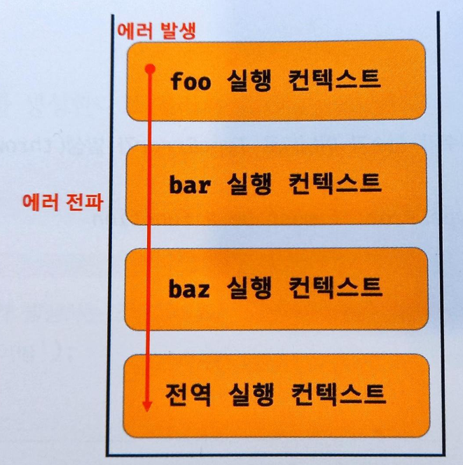

# 에러 처리

## 47.1 에러 처리의 필요성

에러가 발생하지 않는 코드를 작성하는 것은 불가능하다. 따라서 에러는 언제나 발생할 수 있다.
발생한 에러에 대해 대처하지 않고 방치하면 프로그램은 강제 종료된다.

```javascript
console.log('[start]');

foo();
// 발생한 에러를 방치하면 프로그램은 강제 종료된다.

// 에러에 의해 프로그램이 강제 종료되어 아래 코드는 실행되지 않는다.
console.log('[End]')
```

try ... catch 문을 사용해 발생한 에러에 적절하게 대응하면 프로그램이 강제 종료되지 않고 
계속해서 코드를 실행 시킬 수 있다. 


```javascript
console.log('[Start]');

try {
    foo();
}catch (error) {
    console.log(['에러 발생'],error);
    // 에러 발생
}

// 발생한 에러에 적절한 대응을 하면 프로그램이 강제 종료되지 않는다.
console.log('[End]');
```

직접적으로 에러를 발생하지는 않는 예외적인 상황이 발생할 수도 있다.
예외적인 상황에 적절하게 대응하지 않으면 에러로 이어질 가능성이 크다.

```javascript
// DOM에 button 요소가 존재하지 않으면 querySelector 메서드는 에러를 발생시키지 않고 null을 반환한다.
const $button = document.querySelector('button'); // null

$button.classList.add('disabled');
// TypeError: Cannot read properties of null (reading 'classList')
```

위 예제의 querySelector 메서드는 인수로 전달한 문자열이
CSS 선택자 문법에 맞지 않는 경우 에러를 발생시킨다.

```javascript
const $elem = document.querySelector('#1');
// DOMException: Failed to execute 'querySelector' on 'Document': 
// '#1' is not a valid selector.
```

하지만 querySelector 메서드는 인수로 전달한 CSS 선택자 
문자열로 DOM 에서 요소 노드를 찾을 수 없는 경우
에러를 발생시키지 않고 null 을 반환한다. 

이때 if 문으로 querySelector 메서드의 반환값을 확인하거나
단축 평가 또는 옵셔널 체니닝 연산자 ?. 를 사용하지 않으면
다음 처리에서 에러로 이어질 가능성이 크다.

```javascript
// DOM에 button 요소가 존재하지 않는 경우, querySelector 메서드는 에러를 발생시키지 않고 null을 반환한다.
const $button = document.querySelector('button'); // null 
$button.classList.add('disabled');
```

이처럼 에러나 예외적인 상황에 대응하지 않으면 프로그램은 강제 종료될 것이다.
에러나 예외적인 상황은 너무나 다양하기 때문에 아무런 조치 없이
프로그램이 강제 종료된다면 원인을 파악하여 대응하기 어렵다.

에러가 발생하지 않는 코드를 작성하는 것이 이상적이지만 안타깝게도
그것은 불가능하다. 따라서 우리가 작성한 코드에서는 언제나 에러나 예외적인
상황이 발생할 수 있다는 것을 전제하고 이에 대응하는 코드를 작성하는 것이
중요하다. 


## 47.2 try ... catch ... finally 문

try ... catch ... finally 문을 실행하면 먼저 try 코드 블록이 실행된다.

이때 try 코드 블록에 포함된 문 중에서 에러가 발생하면 발생한 에러는
catch 문의 err 변수에 전달되고 catch 코드 블록이 실행된다. 

## 47.3 Error 객체

Error 생성자 함수는 에러 객체를 생성한다. Error 생성자 함수에는
에러를 상세히 설명하는 에러 메시지를 인수로 전달 할 수 있다.

```javascript
const error = new Error('invalid');
```

Error 생성자 함수가 생성한 에러 객체는 message 프로퍼티와 
stack 프로퍼티를 갖는다. message 프로퍼티의 값은 
Error 생성자 함수에 인수로 전달한 에러 메시지이고, 
stack 프로퍼티의 값은 에러를 발생시킨 콜 스택의 호출 정보를 
나타내는 문자열이며 디버깅 목적으로 사용한다.

자바스크립트는 Error 생성자 함수를 포함해 7가지의 에러 객체를
생성할 수 있는 Error 생성자 함수를 제공한다.

SyntaxError , ReferenceError , TypeError , RangeError,
URIError , EvalError 생성자 함수가 생성한 
에러 객체의 프로토타입은 모두 Error.prototype 을 상속받는다.

- Error : 일반적 에러 객체
- SyntaxError : 자바스크립트 문법에 맞지 않는 문을 해석할 때 발생하는 에러 객체
- ReferenceError : 참조할 수 없는 식별자를 참조했을 때 발생하는 에러 객체
- TypeError : 피연산자 또는 인수의 데이터 타입이 유효하지 않을 때 발생하는 에러 객체
- RangeError : 숫자값의 허용 범위를 벗어났을 때 발생하는 에러 객체
- URIError : encodeURI 또는 decodeURI 함수에 부적절한 인수를 전달했을 때 발생하는 에러 객체
- EvalError : eval 함수에서 발생하는 에러 객체

```javascript
1 @ 1; // SyntaxError: Invalid or unexpected token
foo(); // ReferenceError: foo is not defined
null.foo; // TypeError: Cannot read properties of null (reading 'foo')
new Array(-1); // RangeError: Invalid array length
decodeURIComponent('%'); //  URIError: URI malformed
```


## 47.4 throw 문

Error 생성자 함수로 에러 객체를 생성한다고 에러가 발생하는 것은 아니다. 
즉, 에러 객체 생성과 에러 발생은 의미가 다르다.

```javascript
try {
    // 에러 객체를 생성한다고 에러가 발생하는 것은 아니다.
    new Error('something wrong');
}catch (error) {
    console.log(error);
}
```
에러를 발생시키려면 try 코드 블록에서 throw 문으로 에러 객체를 던져야 한다.

throw 문의 표현식은 어떤 값이라도 상관없지만 일반적으로 에러 객체를
지정한다. 에러를 던지면 catch 문의 에러 변수가 생성되고 
던져진 에러 객체가 할당된다. 그리고 catch 코드 블록이 실행되기 시작한다.

```javascript
try {
    // 에러 객체를 던지면 catch 코드 블록이 실행되기 시작한다.
    throw new Error('something wrong');
}catch (error){
    console.log(error);
}
```
예를 들어, 외부에서 전달받은 콜백 함수를 n번만큼 반복 호출하는
repeat 함수를 구현해보자. repeat 함수는 두 번째
인수로 반드시 콜백 함수를 전달 받아야 한다.

만약 두 번째 인수가 함수가 아니면 TypeError 를 발생시키자.
repeat 함수는 에러를 발생시킬 가능성이 있으므로 try 코드 블록
내부에서 호출해야 한다.

```javascript
// 외부에서 전달받은 콜백 함수를 n번만큼 반복 호출한다.
const repeat = (n,f ) => {
    // 매개변수 f에 전달된 인수가 함수가 아니면 TypeError 를 발생시킨다.
    if(typeof f !== 'function') throw new TypeError('f must be a function');
    
    for(var i=0; i<n; i++) {
        f(i);
    }
}

try {
    repeat(2,1); // 두 번째 인수가 함수가 아니므로 TypeError 가 발생한다.
}catch (err) {
    console.error(err); // TypeError : f must be a function
}
```

## 47.5 에러의 전파

에러는 호출자 방향으로 전파된다. 

즉, 콜 스택의 아래 방향
(실행 중인 실행 컨텍스트가 푸시되기 직전에 푸시된 실행 컨텍스트 방향)
으로 전파된다.

```javascript
const foo = () => {
    throw Error('foo 에서 발생한 에러');
};

const bar = () => {
    foo();
};

const baz = () => {
    bar();
};

try {
    baz();
}catch (err) {
    console.error(err);
}
```



이처럼 throw 된 에러를 캐치하지 않으면 
호출자 방향으로 전파된다. 
이띠 throw 된 에러를 캐치하여 적절히 대응하면
프로그램을 강제 종료시키지 않고 코드의 실행 흐름을 복구할 수 있다.

throw된 에러를 어디에서도 캐치하지 않으면 프로그램은 강제 종료된다.

주의할 것은 비동기 함수인 setTimeout 이나 프로미스 후속 처리
메서드의 콜백 함수는 호출자가 없다는 것이다.
setTimeout 이나 프로미스 후속 처리 메서드의 콜백 함수는 
태스크 큐나 마이크로태스크 큐에 일시 저장되었다가 
콜 스택이 비면 이벤트 루프에 의해 콜 스택으로 푸시되어 실행된다. 
이때 콜 스택에 푸시된 콜백 함수의 실행 컨텍스트는 
콜 스택의 가장 하부에 존재하게 된다.
따라서 에러를 전파할 호출자가 존재하지 않는다.